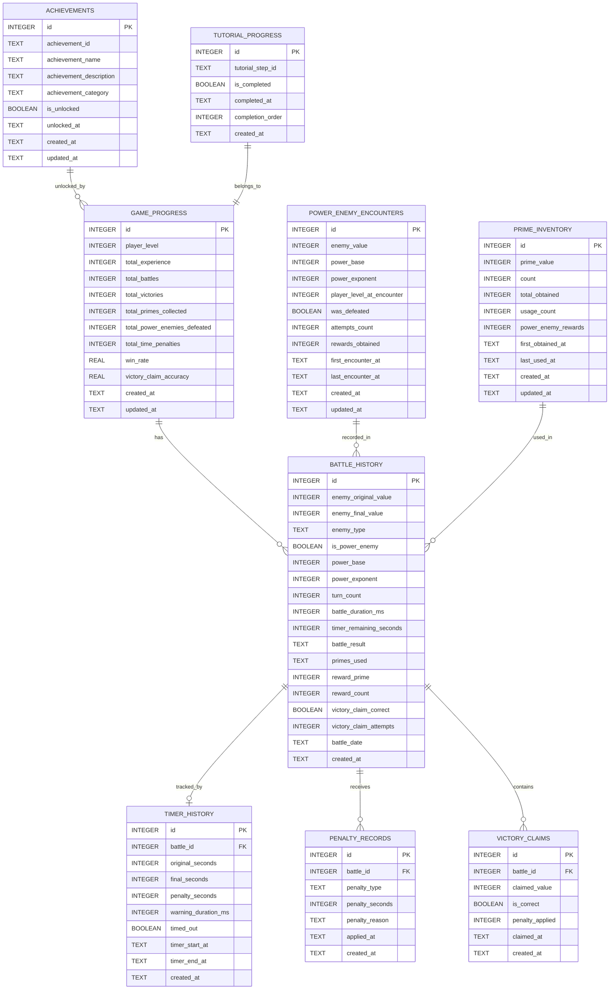

        rewardPrime: 2,
        rewardCount: 4,
        timerHistory: TimerHistoryModel(
          originalSeconds: 90,
          finalSeconds: 20,
          penaltySeconds: 0,
          warningDurationMs: 0,
          timedOut: false,
          timerStartAt: DateTime.now().subtract(Duration(seconds: 70)),
          timerEndAt: DateTime.now(),
          createdAt: DateTime.now(),
        ),
        victoryClaims: [
          VictoryClaimModel(
            claimedValue: 2,
            isCorrect: true,
            penaltyApplied: 0,
            claimedAt: DateTime.now(),
            createdAt: DateTime.now(),
          ),
        ],
        powerEnemyEncounter: PowerEnemyEncounterModel(
          enemyValue: 16,
          powerBase: 2,
          powerExponent: 4,
          playerLevelAtEncounter: 5,
          wasDefeated: true,
          attemptsCount: 1,
          rewardsObtained: 4,
          firstEncounterAt: DateTime.now(),
          lastEncounterAt: DateTime.now(),
          createdAt: DateTime.now(),
          updatedAt: DateTime.now(),
        ),
      );
      
      // 素数2の残量確認（3 - 4 = -1 → 0に修正される）
      final prime2 = await PrimeInventoryDAO(testDb).getPrime(2);
      expect(prime2!.count, equals(0)); // 使い切った
      expect(prime2.powerEnemyRewards, equals(4)); // 累乗敵報酬が加算
      
      // ゲーム進行状況の更新確認
      final progress = await GameProgressDAO(testDb).getGameProgress();
      expect(progress!.totalBattles, equals(21)); // 20 + 1
      expect(progress.totalVictories, equals(17)); // 16 + 1
      expect(progress.totalPowerEnemiesDefeated, equals(4)); // 3 + 1
      
      // 累乗敵遭遇記録の確認
      final powerEnemy16 = await powerEnemyDAO.getPowerEnemyEncounter(16);
      expect(powerEnemy16, isNotNull);
      expect(powerEnemy16!.wasDefeated, isTrue);
      expect(powerEnemy16.rewardsObtained, equals(4));
    });
    
    test('should handle penalty application correctly', () async {
      final penaltyCount = await penaltyDAO.getPenaltyCountByType('wrongVictoryClaim');
      expect(penaltyCount, equals(1));
      
      // 新しいペナルティを追加
      await penaltyDAO.insertPenaltyRecord(PenaltyRecordModel(
        battleId: 1,
        penaltyType: 'escape',
        penaltySeconds: 10,
        penaltyReason: 'Player escaped from battle',
        appliedAt: DateTime.now(),
        createdAt: DateTime.now(),
      ));
      
      final stats = await penaltyDAO.getPenaltyStatistics();
      expect(stats['total_penalties']['total_count'], equals(2));
      expect(stats['total_penalties']['total_seconds'], equals(20));
    });
    
    test('should maintain referential integrity', () async {
      // 戦闘履歴を削除すると関連するタイマー履歴も削除される
      await testDb.delete('battle_history', where: 'id = ?', whereArgs: [1]);
      
      final timerRecords = await timerHistoryDAO.getTimerHistoryByBattle(1);
      expect(timerRecords, isEmpty);
      
      // ペナルティ記録は残る（SET NULL）
      final penalties = await penaltyDAO.getAllPenaltyRecords();
      expect(penalties.length, greaterThan(0));
      expect(penalties.first.battleId, isNull);
    });
  });
  
  group('Data Integrity Tests', () {
    late Database testDb;
    late DataIntegrityChecker integrityChecker;
    
    setUp(() async {
      testDb = await DatabaseTestHelper.createTestDatabase();
      integrityChecker = DataIntegrityChecker(testDb);
    });
    
    tearDown(() async {
      await testDb.close();
    });
    
    test('should detect timer integrity issues', () async {
      // 無効なタイマーデータを挿入
      await testDb.insert('timer_history', {
        'battle_id': 999, // 存在しない戦闘ID
        'original_seconds': -10, // 無効な値
        'final_seconds': 50, // original_secondsより大きい無効な値
        'penalty_seconds': -5, // 無効な値
        'warning_duration_ms': 0,
        'timed_out': 0,
        'timer_start_at': DateTime.now().toIso8601String(),
        'created_at': DateTime.now().toIso8601String(),
      });
      
      final issues = await integrityChecker.checkIntegrity();
      expect(issues.any((issue) => issue.contains('Invalid timer values')), isTrue);
      expect(issues.any((issue) => issue.contains('Orphaned timer history')), isTrue);
    });
    
    test('should detect power enemy integrity issues', () async {
      // 無効な累乗敵データを挿入
      await testDb.insert('power_enemy_encounters', {
        'enemy_value': 8,
        'power_base': 3, // 3^2 = 9 ≠ 8 なので無効
        'power_exponent': 2,
        'player_level_at_encounter': 1,
        'was_defeated': 0,
        'attempts_count': 1,
        'rewards_obtained': 5, // 未撃破なのに報酬があるので無効
        'first_encounter_at': DateTime.now().toIso8601String(),
        'last_encounter_at': DateTime.now().toIso8601String(),
        'created_at': DateTime.now().toIso8601String(),
        'updated_at': DateTime.now().toIso8601String(),
      });
      
      final issues = await integrityChecker.checkIntegrity();
      expect(issues.any((issue) => issue.contains('Invalid power enemy')), isTrue);
    });
    
    test('should repair data automatically', () async {
      // 無効なデータを挿入
      await testDb.insert('victory_claims', {
        'battle_id': 1,
        'claimed_value': 1, // 無効（2未満）
        'is_correct': 1,
        'penalty_applied': 10, // 正解なのにペナルティがあるので無効
        'claimed_at': DateTime.now().toIso8601String(),
        'created_at': DateTime.now().toIso8601String(),
      });
      
      final issuesBefore = await integrityChecker.checkIntegrity();
      expect(issuesBefore.isNotEmpty, isTrue);
      
      await integrityChecker.repairData();
      
      final issuesAfter = await integrityChecker.checkIntegrity();
      expect(issuesAfter.length, lessThan(issuesBefore.length));
    });
  });
}

class PrimeUsage {
  final int primeValue;
  final int count;
  
  PrimeUsage({required this.primeValue, required this.count});
}
```

## 10. 初期データ投入（新機能対応）

### 10.1 初期データ投入（更新版）

```dart
class InitialDataSeeder {
  static Future<void> seedInitialData(Database db) async {
    await _seedAchievements(db);
    await _seedTutorialSteps(db);
    await _seedInitialGameProgress(db);
    await _seedInitialPrimes(db);
  }
  
  static Future<void> _seedAchievements(Database db) async {
    final achievements = [
      // 基本実績
      {
        'achievement_id': 'first_victory',
        'achievement_name': '初勝利',
        'achievement_description': '初めての戦闘に勝利する',
        'achievement_category': 'battle',
      },
      {
        'achievement_id': 'prime_collector_5',
        'achievement_name': '素数コレクター・ブロンズ',
        'achievement_description': '5種類の素数を獲得する',
        'achievement_category': 'collection',
      },
      {
        'achievement_id': 'prime_collector_10',
        'achievement_name': '素数コレクター・シルバー',
        'achievement_description': '10種類の素数を獲得する',
        'achievement_category': 'collection',
      },
      {
        'achievement_id': 'prime_collector_20',
        'achievement_name': '素数コレクター・ゴールド',
        'achievement_description': '20種類の素数を獲得する',
        'achievement_category': 'collection',
      },
      
      // 戦闘実績
      {
        'achievement_id': 'battle_streak_5',
        'achievement_name': '連勝記録',
        'achievement_description': '5連勝を達成する',
        'achievement_category': 'battle',
      },
      {
        'achievement_id': 'large_enemy_defeater',
        'achievement_name': 'ビッグハンター',
        'achievement_description': '1000以上の合成数を倒す',
        'achievement_category': 'battle',
      },
      
      // タイマー関連実績
      {
        'achievement_id': 'speed_demon',
        'achievement_name': 'スピードデーモン',
        'achievement_description': '10秒以内に戦闘を終了する',
        'achievement_category': 'timer',
      },
      {
        'achievement_id': 'time_master',
        'achievement_name': 'タイムマスター',
        'achievement_description': '残り時間80%以上で勝利する',
        'achievement_category': 'timer',
      },
      {
        'achievement_id': 'no_penalty',
        'achievement_name': 'ペナルティ無し',
        'achievement_description': 'ペナルティなしで10連勝',
        'achievement_category': 'timer',
      },
      {
        'achievement_id': 'penalty_survivor',
        'achievement_name': 'ペナルティサバイバー',
        'achievement_description': '累計ペナルティ100秒に到達',
        'achievement_category': 'timer',
      },
      
      // 累乗敵関連実績
      {
        'achievement_id': 'power_hunter',
        'achievement_name': 'パワーハンター',
        'achievement_description': '初めての累乗敵撃破',
        'achievement_category': 'power_enemy',
      },
      {
        'achievement_id': 'square_master',
        'achievement_name': 'スクエアマスター',
        'achievement_description': '2乗の累乗敵を10体撃破',
        'achievement_category': 'power_enemy',
      },
      {
        'achievement_id': 'cube_master',
        'achievement_name': 'キューブマスター',
        'achievement_description': '3乗の累乗敵を5体撃破',
        'achievement_category': 'power_enemy',
      },
      {
        'achievement_id': 'power_collector',
        'achievement_name': 'パワーコレクター',
        'achievement_description': '累乗敵から100個の素数を獲得',
        'achievement_category': 'power_enemy',
      },
      
      // 勝利判定関連実績
      {
        'achievement_id': 'perfect_judge',
        'achievement_name': 'パーフェクトジャッジ',
        'achievement_description': '勝利判定正答率95%以上を達成',
        'achievement_category': 'accuracy',
      },
      {
        'achievement_id': 'quick_decision',
        'achievement_name': 'クイックディシジョン',
        'achievement_description': '1秒以内に勝利判定を行う',
        'achievement_category': 'accuracy',
      },
      {
        'achievement_id': 'claim_master',
        'achievement_name': 'クレームマスター',
        'achievement_description': '50回の勝利判定で90%以上の正答率',
        'achievement_category': 'accuracy',
      },
      {
        'achievement_id': 'mistake_learner',
        'achievement_name': 'ミステイクラーナー',
        'achievement_description': '間違いから学んで正答率を向上させる',
        'achievement_category': 'accuracy',
      },
      
      // 効率性実績
      {
        'achievement_id': 'efficiency_master',
        'achievement_name': '効率マスター',
        'achievement_description': '最小ターン数で敵を倒す',
        'achievement_category': 'battle',
      },
      {
        'achievement_id': 'resource_manager',
        'achievement_name': 'リソースマネージャー',
        'achievement_description': '素数を1個も無駄にせずに20連勝',
        'achievement_category': 'battle',
      },
    ];
    
    for (final achievement in achievements) {
      await db.insert('achievements', {
        ...achievement,
        'is_unlocked': false,
        'created_at': DateTime.now().toIso8601String(),
        'updated_at': DateTime.now().toIso8601String(),
      });
    }
  }
  
  static Future<void> _seedTutorialSteps(Database db) async {
    final tutorialSteps = [
      {
        'tutorial_step_id': 'intro_welcome',
        'is_completed': false,
        'completion_order': 1,
      },
      {
        'tutorial_step_id': 'basic_attack',
        'is_completed': false,
        'completion_order': 2,
      },
      {
        'tutorial_step_id': 'prime_collection',
        'is_completed': false,
        'completion_order': 3,
      },
      {
        'tutorial_step_id': 'timer_explanation',
        'is_completed': false,
        'completion_order': 4,
      },
      {
        'tutorial_step_id': 'victory_claim_tutorial',
        'is_completed': false,
        'completion_order': 5,
      },
      {
        'tutorial_step_id': 'escape_mechanism',
        'is_completed': false,
        'completion_order': 6,
      },
      {
        'tutorial_step_id': 'penalty_explanation',
        'is_completed': false,
        'completion_order': 7,
      },
      {
        'tutorial_step_id': 'power_enemy_introduction',
        'is_completed': false,
        'completion_order': 8,
      },
      {
        'tutorial_step_id': 'inventory_management',
        'is_completed': false,
        'completion_order': 9,
      },
      {
        'tutorial_step_id': 'advanced_strategies',
        'is_completed': false,
        'completion_order': 10,
      },
    ];
    
    for (final step in tutorialSteps) {
      await db.insert('tutorial_progress', {
        ...step,
        'created_at': DateTime.now().toIso8601String(),
      });
    }
  }
  
  static Future<void> _seedInitialGameProgress(Database db) async {
    await db.insert('game_progress', {
      'player_level': 1,
      'total_experience': 0,
      'total_battles': 0,
      'total_victories': 0,
      'total_primes_collected': 0,
      'total_power_enemies_defeated': 0,
      'total_time_penalties': 0,
      'win_rate': 0.0,
      'victory_claim_accuracy': 0.0,
      'created_at': DateTime.now().toIso8601String(),
      'updated_at': DateTime.now().toIso8601String(),
    });
  }
  
  static Future<void> _seedInitialPrimes(Database db) async {
    // チュートリアル用の初期素数（要件に従って2を3個）
    await db.insert('prime_inventory', {
      'prime_value': 2,
      'count': 3,
      'total_obtained': 3,
      'usage_count': 0,
      'power_enemy_rewards': 0,
      'first_obtained_at': DateTime.now().toIso8601String(),
      'created_at': DateTime.now().toIso8601String(),
      'updated_at': DateTime.now().toIso8601String(),
    });
  }
}
```

## 11. 運用・監視

### 11.1 パフォーマンス監視

```dart
class DatabasePerformanceMonitor {
  final Database _database;
  
  DatabasePerformanceMonitor(this._database);
  
  Future<Map<String, dynamic>> getPerformanceMetrics() async {
    final metrics = <String, dynamic>{};
    
    // データベースサイズ
    final sizeResult = await _database.rawQuery('PRAGMA page_count');
    final pageSize = await _database.rawQuery('PRAGMA page_size');
    final dbSize = (sizeResult.first['page_count'] as int) * 
                   (pageSize.first['page_size'] as int);
    metrics['database_size_bytes'] = dbSize;
    
    // テーブル別レコード数
    final tables = [
      'game_progress', 'prime_inventory', 'battle_history',
      'timer_history', 'penalty_records', 'power_enemy_encounters',
      'victory_claims', 'achievements', 'tutorial_progress'
    ];
    
    for (final table in tables) {
      final result = await _database.rawQuery('SELECT COUNT(*) as count FROM $table');
      metrics['${table}_count'] = result.first['count'];
    }
    
    // インデックス使用状況
    final indexStats = await _database.rawQuery('PRAGMA index_list(battle_history)');
    metrics['index_count'] = indexStats.length;
    
    // 最後のバキューム実行時刻
    try {
      final vacuumResult = await _database.rawQuery('PRAGMA incremental_vacuum');
      metrics['last_vacuum'] = DateTime.now().toIso8601String();
    } catch (e) {
      metrics['vacuum_error'] = e.toString();
    }
    
    return metrics;
  }
  
  Future<List<String>> analyzeSlowQueries() async {
    final warnings = <String>[];
    
    // 大きなテーブルのフルテーブルスキャンを検出
    final battleHistoryCount = await _database.rawQuery('SELECT COUNT(*) as count FROM battle_history');
    final count = battleHistoryCount.first['count'] as int;
    
    if (count > 1000) {
      warnings.add('Large battle_history table ($count records) - consider archiving old data');
    }
    
    // 孤立したレコードの検出
    final orphanedTimers = await _database.rawQuery('''
      SELECT COUNT(*) as count FROM timer_history th
      LEFT JOIN battle_history bh ON th.battle_id = bh.id
      WHERE bh.id IS NULL
    ''');
    
    final orphanedCount = orphanedTimers.first['count'] as int;
    if (orphanedCount > 0) {
      warnings.add('Found $orphanedCount orphaned timer history records');
    }
    
    return warnings;
  }
}
```

### 11.2 データ使用量分析

```dart
class DataUsageAnalyzer {
  final Database _database;
  
  DataUsageAnalyzer(this._database);
  
  Future<Map<String, dynamic>> generateUsageReport() async {
    final report = <String, dynamic>{};
    
    // プレイヤー行動パターン分析
    final playingPatterns = await _analyzePlayingPatterns();
    report['playing_patterns'] = playingPatterns;
    
    // 累乗敵との遭遇パターン
    final powerEnemyPatterns = await _analyzePowerEnemyPatterns();
    report['power_enemy_patterns'] = powerEnemyPatterns;
    
    // タイマー使用パターン
    final timerPatterns = await _analyzeTimerPatterns();
    report['timer_patterns'] = timerPatterns;
    
    // 勝利判定パターン
    final victoryClaimPatterns = await _analyzeVictoryClaimPatterns();
    report['victory_claim_patterns'] = victoryClaimPatterns;
    
    return report;
  }
  
  Future<Map<String, dynamic>> _analyzePlayingPatterns() async {
    final result = await _database.rawQuery('''
      SELECT 
        COUNT(*) as total_battles,
        AVG(turn_count) as avg_turns,
        AVG(battle_duration_ms) as avg_duration_ms,
        COUNT(CASE WHEN battle_result = 'victory' THEN 1 END) * 100.0 / COUNT(*) as win_rate,
        COUNT(CASE WHEN is_power_enemy = 1 THEN 1 END) as power_enemy_encounters
      FROM battle_history
      WHERE battle_date >= DATE('now', '-30 days')
    ''');
    
    return result.first;
  }
  
  Future<Map<String, dynamic>> _analyzePowerEnemyPatterns() async {
    final result = await _database.rawQuery('''
      SELECT 
        AVG(attempts_count) as avg_attempts,
        COUNT(CASE WHEN was_defeated = 1 THEN 1 END) * 100.0 / COUNT(*) as defeat_rate,
        SUM(rewards_obtained) as total_rewards,
        power_base,
        COUNT(*) as encounters_per_base
      FROM power_enemy_encounters
      GROUP BY power_base
    ''');
    
    return {'by_base': result};
  }
  
  Future<Map<String, dynamic>> _analyzeTimerPatterns() async {
    final result = await _database.rawQuery('''
      SELECT 
        AVG(original_seconds - final_seconds) as avg_time_used,
        COUNT(CASE WHEN timed_out = 1 THEN 1 END) * 100.0 / COUNT(*) as timeout_rate,
        AVG(penalty_seconds) as avg_penalty,
        SUM(warning_duration_ms) as total_warning_time_ms
      FROM timer_history
      WHERE timer_start_at >= DATE('now', '-30 days')
    ''');
    
    return result.first;
  }
  
  Future<Map<String, dynamic>> _analyzeVictoryClaimPatterns() async {
    final result = await _database.rawQuery('''
      SELECT 
        COUNT(CASE WHEN is_correct = 1 THEN 1 END) * 100.0 / COUNT(*) as accuracy_rate,
        AVG(penalty_applied) as avg_penalty_per_claim,
        COUNT(*) as total_claims
      FROM victory_claims
      WHERE claimed_at >= DATE('now', '-30 days')
    ''');
    
    return result.first;
  }
}
```

この包括的なデータベース設計により、合成数ハンターアプリの全ての新機能（制限時間、勝利判定、累乗敵、ペナルティシステム）を効率的かつ安全に管理できます。特に教育効果の測定、ゲームバランスの調整、ユーザー体験の分析に必要なデータを詳細に記録・分析できる設計となっています。## 7. パフォーマンス最適化（更新版）

### 7.1 インデックス戦略（新機能対応）

```sql
-- 既存の基本インデックス
CREATE INDEX idx_battle_history_date_result 
ON battle_history(battle_date, battle_result);

CREATE INDEX idx_prime_inventory_available 
ON prime_inventory(count) WHERE count > 0;

-- 新機能対応の複合インデックス
CREATE INDEX idx_battle_history_power_composite 
ON battle_history(is_power_enemy, battle_result, battle_date);

CREATE INDEX idx_timer_history_performance 
ON timer_history(timed_out, penalty_seconds, original_seconds);

CREATE INDEX idx_penalty_records_analysis 
ON penalty_records(penalty_type, applied_at, penalty_seconds);

CREATE INDEX idx_victory_claims_accuracy 
ON victory_claims(is_correct, claimed_at, battle_id);

CREATE INDEX idx_power_enemy_encounters_stats 
ON power_enemy_encounters(power_base, was_defeated, rewards_obtained);

-- パフォーマンス重視のカバリングインデックス
CREATE INDEX idx_battle_history_covering 
ON battle_history(battle_date, battle_result, is_power_enemy, reward_count, timer_remaining_seconds);

CREATE INDEX idx_prime_inventory_full_covering 
ON prime_inventory(prime_value, count, usage_count, power_enemy_rewards, total_obtained);
```

### 7.2 クエリ最適化（新機能対応）

#### よく使用されるクエリの例（更新版）

```dart
class OptimizedQueries {
  // 基本的なクエリ（既存）
  static const String getAvailablePrimesQuery = '''
    SELECT prime_value, count 
    FROM prime_inventory 
    WHERE count > 0 
    ORDER BY prime_value ASC
  ''';
  
  // タイマー統計クエリ
  static const String getTimerStatisticsQuery = '''
    SELECT 
      AVG(original_seconds) as avg_original_time,
      AVG(final_seconds) as avg_final_time,
      AVG(penalty_seconds) as avg_penalty,
      COUNT(CASE WHEN timed_out = 1 THEN 1 END) as timeout_count,
      COUNT(*) as total_battles,
      SUM(penalty_seconds) as total_penalty_seconds,
      AVG(warning_duration_ms) as avg_warning_duration
    FROM timer_history 
    WHERE timer_start_at >= ?
  ''';
  
  // 累乗敵統計クエリ
  static const String getPowerEnemyStatsQuery = '''
    SELECT 
      power_base,
      COUNT(*) as encounter_count,
      COUNT(CASE WHEN was_defeated = 1 THEN 1 END) as defeat_count,
      SUM(rewards_obtained) as total_rewards,
      AVG(attempts_count) as avg_attempts,
      MAX(power_exponent) as max_exponent
    FROM power_enemy_encounters 
    GROUP BY power_base
    ORDER BY power_base ASC
  ''';
  
  // 勝利判定精度クエリ
  static const String getVictoryClaimAccuracyQuery = '''
    SELECT 
      DATE(claimed_at) as claim_date,
      COUNT(CASE WHEN is_correct = 1 THEN 1 END) as correct_count,
      COUNT(*) as total_count,
      CAST(COUNT(CASE WHEN is_correct = 1 THEN 1 END) AS REAL) / COUNT(*) as accuracy_rate,
      SUM(penalty_applied) as total_penalty
    FROM victory_claims 
    WHERE claimed_at >= DATE('now', '-30 days')
    GROUP BY DATE(claimed_at)
    ORDER BY claim_date DESC
  ''';
  
  // 総合ダッシュボード用クエリ
  static const String getDashboardStatsQuery = '''
    SELECT 
      (SELECT COUNT(*) FROM battle_history WHERE battle_date >= DATE('now', '-7 days')) as battles_this_week,
      (SELECT COUNT(*) FROM battle_history WHERE battle_result = 'victory' AND battle_date >= DATE('now', '-7 days')) as victories_this_week,
      (SELECT COUNT(*) FROM power_enemy_encounters WHERE was_defeated = 1) as power_enemies_defeated,
      (SELECT AVG(CASE WHEN timer_remaining_seconds IS NOT NULL THEN timer_remaining_seconds ELSE 0 END) FROM battle_history WHERE battle_date >= DATE('now', '-7 days')) as avg_time_remaining,
      (SELECT COUNT(CASE WHEN is_correct = 1 THEN 1 END) * 100.0 / COUNT(*) FROM victory_claims WHERE claimed_at >= DATE('now', '-7 days')) as accuracy_this_week
  ''';
  
  // ペナルティ分析クエリ
  static const String getPenaltyAnalysisQuery = '''
    SELECT 
      penalty_type,
      COUNT(*) as penalty_count,
      SUM(penalty_seconds) as total_seconds,
      AVG(penalty_seconds) as avg_seconds,
      DATE(applied_at) as penalty_date
    FROM penalty_records 
    WHERE applied_at >= DATE('now', '-30 days')
    GROUP BY penalty_type, DATE(applied_at)
    ORDER BY penalty_date DESC, penalty_count DESC
  ''';
}
```

### 7.3 データベースメンテナンス

#### 定期メンテナンス用クエリ

```dart
class DatabaseMaintenance {
  final Database _database;
  
  DatabaseMaintenance(this._database);
  
  /// 統計情報の更新
  Future<void> updateStatistics() async {
    await _database.execute('ANALYZE');
    await _database.execute('PRAGMA optimize');
  }
  
  /// 古いデータのクリーンアップ（1年以上前のデータを削除）
  Future<void> cleanupOldData() async {
    await _database.transaction((txn) async {
      // 1年以上前の戦闘履歴を削除
      await txn.execute('''
        DELETE FROM battle_history 
        WHERE created_at < DATE('now', '-1 year')
      ''');
      
      // 1年以上前のタイマー履歴を削除
      await txn.execute('''
        DELETE FROM timer_history 
        WHERE created_at < DATE('now', '-1 year')
      ''');
      
      // 1年以上前のペナルティ記録を削除
      await txn.execute('''
        DELETE FROM penalty_records 
        WHERE created_at < DATE('now', '-1 year')
      ''');
      
      // 1年以上前の勝利判定記録を削除
      await txn.execute('''
        DELETE FROM victory_claims 
        WHERE created_at < DATE('now', '-1 year')
      ''');
      
      // VACUUM で空き領域を回収
      await txn.execute('VACUUM');
    });
  }
  
  /// インデックスの再構築
  Future<void> rebuildIndexes() async {
    await _database.execute('REINDEX');
  }
  
  /// データベースの整合性チェック
  Future<List<String>> checkIntegrity() async {
    final result = await _database.rawQuery('PRAGMA integrity_check');
    return result.map((row) => row.values.first.toString()).toList();
  }
}
```

## 8. データ整合性・バックアップ（更新版）

### 8.1 データ検証（新機能対応）

```dart
class DataIntegrityChecker {
  final Database _database;
  
  DataIntegrityChecker(this._database);
  
  Future<List<String>> checkIntegrity() async {
    final issues = <String>[];
    
    // 既存の検証
    await _checkBasicIntegrity(issues);
    
    // 新機能の検証
    await _checkTimerIntegrity(issues);
    await _checkPowerEnemyIntegrity(issues);
    await _checkVictoryClaimIntegrity(issues);
    await _checkPenaltyIntegrity(issues);
    
    return issues;
  }
  
  Future<void> _checkBasicIntegrity(List<String> issues) async {
    // 素数の妥当性チェック
    final invalidPrimes = await _database.rawQuery('''
      SELECT prime_value FROM prime_inventory 
      WHERE prime_value < 2
    ''');
    
    if (invalidPrimes.isNotEmpty) {
      issues.add('Invalid prime values found: ${invalidPrimes.map((p) => p['prime_value']).join(', ')}');
    }
    
    // カウントの整合性チェック
    final invalidCounts = await _database.rawQuery('''
      SELECT prime_value FROM prime_inventory 
      WHERE count < 0 OR count > total_obtained
    ''');
    
    if (invalidCounts.isNotEmpty) {
      issues.add('Invalid count values found');
    }
  }
  
  Future<void> _checkTimerIntegrity(List<String> issues) async {
    // タイマー時間の妥当性チェック
    final invalidTimers = await _database.rawQuery('''
      SELECT id FROM timer_history 
      WHERE original_seconds <= 0 
      OR final_seconds < 0 
      OR penalty_seconds < 0
      OR (final_seconds > original_seconds AND penalty_seconds = 0)
    ''');
    
    if (invalidTimers.isNotEmpty) {
      issues.add('Invalid timer values found: ${invalidTimers.length} records');
    }
    
    // 孤立したタイマー履歴チェック
    final orphanedTimers = await _database.rawQuery('''
      SELECT th.id FROM timer_history th
      LEFT JOIN battle_history bh ON th.battle_id = bh.id
      WHERE bh.id IS NULL
    ''');
    
    if (orphanedTimers.isNotEmpty) {
      issues.add('Orphaned timer history records: ${orphanedTimers.length}');
    }
  }
  
  Future<void> _checkPowerEnemyIntegrity(List<String> issues) async {
    // 累乗計算の妥当性チェック
    final invalidPowerEnemies = await _database.rawQuery('''
      SELECT enemy_value, power_base, power_exponent FROM power_enemy_encounters 
      WHERE enemy_value != POWER(power_base, power_exponent)
      OR power_base < 2 
      OR power_exponent < 2
    ''');
    
    if (invalidPowerEnemies.isNotEmpty) {
      issues.add('Invalid power enemy calculations: ${invalidPowerEnemies.length} records');
    }
    
    // 報酬数の妥当性チェック
    final invalidRewards = await _database.rawQuery('''
      SELECT id FROM power_enemy_encounters 
      WHERE rewards_obtained < 0 
      OR (was_defeated = 0 AND rewards_obtained > 0)
    ''');
    
    if (invalidRewards.isNotEmpty) {
      issues.add('Invalid power enemy rewards: ${invalidRewards.length} records');
    }
  }
  
  Future<void> _checkVictoryClaimIntegrity(List<String> issues) async {
    // 勝利判定の妥当性チェック
    final invalidClaims = await _database.rawQuery('''
      SELECT id FROM victory_claims 
      WHERE claimed_value < 2 
      OR penalty_applied < 0
      OR (is_correct = 1 AND penalty_applied > 0)
    ''');
    
    if (invalidClaims.isNotEmpty) {
      issues.add('Invalid victory claims: ${invalidClaims.length} records');
    }
  }
  
  Future<void> _checkPenaltyIntegrity(List<String> issues) async {
    // ペナルティの妥当性チェック
    final invalidPenalties = await _database.rawQuery('''
      SELECT id FROM penalty_records 
      WHERE penalty_seconds <= 0 
      OR penalty_type NOT IN ('escape', 'wrongVictoryClaim', 'timeOut')
    ''');
    
    if (invalidPenalties.isNotEmpty) {
      issues.add('Invalid penalty records: ${invalidPenalties.length} records');
    }
  }
  
  Future<void> repairData() async {
    await _database.transaction((txn) async {
      // 基本データの修正
      await _repairBasicData(txn);
      
      // 新機能データの修正
      await _repairTimerData(txn);
      await _repairPowerEnemyData(txn);
      await _repairVictoryClaimData(txn);
      await _repairPenaltyData(txn);
      
      // 統計の再計算
      await _recalculateStatistics(txn);
    });
  }
  
  Future<void> _repairBasicData(Transaction txn) async {
    // 勝率の修正
    await txn.rawUpdate('''
      UPDATE game_progress 
      SET win_rate = CASE 
        WHEN total_battles = 0 THEN 0.0
        ELSE CAST(total_victories AS REAL) / total_battles
      END
    ''');
    
    // 負の値の修正
    await txn.rawUpdate('''
      UPDATE prime_inventory 
      SET count = 0 
      WHERE count < 0
    ''');
  }
  
  Future<void> _repairTimerData(Transaction txn) async {
    // 無効なタイマーデータの修正
    await txn.rawUpdate('''
      UPDATE timer_history 
      SET final_seconds = 0
      WHERE final_seconds < 0
    ''');
    
    await txn.rawUpdate('''
      UPDATE timer_history 
      SET penalty_seconds = 0
      WHERE penalty_seconds < 0
    ''');
  }
  
  Future<void> _repairPowerEnemyData(Transaction txn) async {
    // 報酬数の修正
    await txn.rawUpdate('''
      UPDATE power_enemy_encounters 
      SET rewards_obtained = 0
      WHERE was_defeated = 0 AND rewards_obtained > 0
    ''');
  }
  
  Future<void> _repairVictoryClaimData(Transaction txn) async {
    // ペナルティの修正
    await txn.rawUpdate('''
      UPDATE victory_claims 
      SET penalty_applied = 0
      WHERE is_correct = 1 AND penalty_applied > 0
    ''');
  }
  
  Future<void> _repairPenaltyData(Transaction txn) async {
    // 無効なペナルティ時間の修正
    await txn.rawUpdate('''
      UPDATE penalty_records 
      SET penalty_seconds = 10
      WHERE penalty_seconds <= 0
    ''');
  }
  
  Future<void> _recalculateStatistics(Transaction txn) async {
    // 勝利判定精度の再計算
    final accuracyResult = await txn.rawQuery('''
      SELECT 
        COUNT(CASE WHEN is_correct = 1 THEN 1 END) * 1.0 / COUNT(*) as accuracy
      FROM victory_claims
    ''');
    
    final accuracy = accuracyResult.first['accuracy'] as double? ?? 0.0;
    
    await txn.rawUpdate('''
      UPDATE game_progress 
      SET victory_claim_accuracy = ?
    ''', [accuracy]);
    
    // 累乗敵撃破数の再計算
    final powerEnemyResult = await txn.rawQuery('''
      SELECT COUNT(*) as count
      FROM power_enemy_encounters
      WHERE was_defeated = 1
    ''');
    
    final powerEnemyCount = powerEnemyResult.first['count'] as int;
    
    await txn.rawUpdate('''
      UPDATE game_progress 
      SET total_power_enemies_defeated = ?
    ''', [powerEnemyCount]);
    
    // 時間ペナルティ総数の再計算
    final penaltyResult = await txn.rawQuery('''
      SELECT SUM(penalty_seconds) as total
      FROM penalty_records
    ''');
    
    final totalPenalty = penaltyResult.first['total'] as int? ?? 0;
    
    await txn.rawUpdate('''
      UPDATE game_progress 
      SET total_time_penalties = ?
    ''', [totalPenalty]);
  }
}
```

### 8.2 データバックアップ・復元（更新版）

```dart
class DataBackupService {
  final Database _database;
  
  DataBackupService(this._database);
  
  Future<Map<String, dynamic>> exportData() async {
    final gameProgress = await _database.query('game_progress');
    final primeInventory = await _database.query('prime_inventory');
    final battleHistory = await _database.query('battle_history');
    final achievements = await _database.query('achievements');
    final tutorialProgress = await _database.query('tutorial_progress');
    
    // 新機能のデータ
    final timerHistory = await _database.query('timer_history');
    final penaltyRecords = await _database.query('penalty_records');
    final powerEnemyEncounters = await _database.query('power_enemy_encounters');
    final victoryClaims = await _database.query('victory_claims');
    
    return {
      'version': DatabaseConstants.databaseVersion,
      'export_date': DateTime.now().toIso8601String(),
      'data': {
        'game_progress': gameProgress,
        'prime_inventory': primeInventory,
        'battle_history': battleHistory,
        'achievements': achievements,
        'tutorial_progress': tutorialProgress,
        'timer_history': timerHistory,
        'penalty_records': penaltyRecords,
        'power_enemy_encounters': powerEnemyEncounters,
        'victory_claims': victoryClaims,
      },
      'statistics': await _generateBackupStatistics(),
    };
  }
  
  Future<Map<String, dynamic>> _generateBackupStatistics() async {
    final stats = await _database.rawQuery('''
      SELECT 
        (SELECT COUNT(*) FROM battle_history) as total_battles,
        (SELECT COUNT(*) FROM prime_inventory WHERE count > 0) as active_primes,
        (SELECT COUNT(*) FROM power_enemy_encounters) as power_enemy_encounters,
        (SELECT AVG(victory_claim_accuracy) FROM game_progress) as avg_accuracy,
        (SELECT SUM(penalty_seconds) FROM penalty_records) as total_penalty_seconds
    ''');
    
    return stats.first;
  }
  
  Future<bool> importData(Map<String, dynamic> backupData) async {
    try {
      await _database.transaction((txn) async {
        // 既存データをクリア
        await _clearAllData(txn);
        
        // バックアップデータを復元
        final data = backupData['data'] as Map<String, dynamic>;
        
        await _restoreTableData(txn, 'game_progress', data['game_progress']);
        await _restoreTableData(txn, 'prime_inventory', data['prime_inventory']);
        await _restoreTableData(txn, 'battle_history', data['battle_history']);
        await _restoreTableData(txn, 'achievements', data['achievements']);
        await _restoreTableData(txn, 'tutorial_progress', data['tutorial_progress']);
        
        // 新機能のテーブル（存在する場合のみ）
        if (data.containsKey('timer_history')) {
          await _restoreTableData(txn, 'timer_history', data['timer_history']);
        }
        if (data.containsKey('penalty_records')) {
          await _restoreTableData(txn, 'penalty_records', data['penalty_records']);
        }
        if (data.containsKey('power_enemy_encounters')) {
          await _restoreTableData(txn, 'power_enemy_encounters', data['power_enemy_encounters']);
        }
        if (data.containsKey('victory_claims')) {
          await _restoreTableData(txn, 'victory_claims', data['victory_claims']);
        }
      });
      
      return true;
    } catch (e) {
      return false;
    }
  }
  
  Future<void> _clearAllData(Transaction txn) async {
    final tables = [
      'victory_claims',
      'penalty_records',
      'timer_history',
      'battle_history',
      'power_enemy_encounters',
      'tutorial_progress',
      'achievements',
      'prime_inventory',
      'game_progress',
    ];
    
    for (final table in tables) {
      await txn.delete(table);
    }
  }
  
  Future<void> _restoreTableData(Transaction txn, String tableName, dynamic tableData) async {
    if (tableData is List) {
      for (final row in tableData) {
        await txn.insert(tableName, row as Map<String, dynamic>);
      }
    }
  }
}
```

## 9. テスト戦略（更新版）

### 9.1 データベーステスト（新機能対応）

```dart
class DatabaseTestHelper {
  static Future<Database> createTestDatabase() async {
    return await openDatabase(
      inMemoryDatabasePath,
      version: DatabaseConstants.databaseVersion,
      onCreate: (db, version) async {
        await DatabaseMigration.migrate(db, 0, version);
      },
    );
  }
  
  static Future<void> seedTestData(Database db) async {
    // 基本テストデータ
    await _seedBasicTestData(db);
    
    // 新機能テストデータ
    await _seedTimerTestData(db);
    await _seedPowerEnemyTestData(db);
    await _seedVictoryClaimTestData(db);
    await _seedPenaltyTestData(db);
  }
  
  static Future<void> _seedBasicTestData(Database db) async {
    // ゲーム進行状況
    await db.insert('game_progress', {
      'player_level': 5,
      'total_experience': 1250,
      'total_battles': 20,
      'total_victories': 16,
      'total_primes_collected': 8,
      'total_power_enemies_defeated': 3,
      'total_time_penalties': 50,
      'win_rate': 0.8,
      'victory_claim_accuracy': 0.85,
      'created_at': DateTime.now().toIso8601String(),
      'updated_at': DateTime.now().toIso8601String(),
    });
    
    // 素数インベントリ
    final testPrimes = [2, 3, 5, 7, 11];
    for (int i = 0; i < testPrimes.length; i++) {
      await db.insert('prime_inventory', {
        'prime_value': testPrimes[i],
        'count': 3 - i,
        'total_obtained': 5,
        'usage_count': i,
        'power_enemy_rewards': i > 2 ? 1 : 0,
        'first_obtained_at': DateTime.now()
            .subtract(Duration(days: i))
            .toIso8601String(),
        'created_at': DateTime.now().toIso8601String(),
        'updated_at': DateTime.now().toIso8601String(),
      });
    }
  }
  
  static Future<void> _seedTimerTestData(Database db) async {
    // 戦闘履歴を先に作成
    final battleId = await db.insert('battle_history', {
      'enemy_original_value': 12,
      'enemy_final_value': 3,
      'enemy_type': 'small',
      'is_power_enemy': 0,
      'turn_count': 2,
      'battle_duration_ms': 5000,
      'timer_remaining_seconds': 15,
      'battle_result': 'victory',
      'primes_used': '[2, 2]',
      'reward_prime': 3,
      'reward_count': 1,
      'victory_claim_correct': 1,
      'victory_claim_attempts': 1,
      'battle_date': DateTime.now().toIso8601String(),
      'created_at': DateTime.now().toIso8601String(),
    });
    
    // タイマー履歴
    await db.insert('timer_history', {
      'battle_id': battleId,
      'original_seconds': 30,
      'final_seconds': 15,
      'penalty_seconds': 0,
      'warning_duration_ms': 2000,
      'timed_out': 0,
      'timer_start_at': DateTime.now().subtract(Duration(seconds: 15)).toIso8601String(),
      'timer_end_at': DateTime.now().toIso8601String(),
      'created_at': DateTime.now().toIso8601String(),
    });
  }
  
  static Future<void> _seedPowerEnemyTestData(Database db) async {
    // 累乗敵遭遇データ
    await db.insert('power_enemy_encounters', {
      'enemy_value': 8,
      'power_base': 2,
      'power_exponent': 3,
      'player_level_at_encounter': 3,
      'was_defeated': 1,
      'attempts_count': 2,
      'rewards_obtained': 3,
      'first_encounter_at': DateTime.now().subtract(Duration(days: 2)).toIso8601String(),
      'last_encounter_at': DateTime.now().toIso8601String(),
      'created_at': DateTime.now().toIso8601String(),
      'updated_at': DateTime.now().toIso8601String(),
    });
  }
  
  static Future<void> _seedVictoryClaimTestData(Database db) async {
    // 勝利判定データ（前回作成したbattleIdを使用）
    await db.insert('victory_claims', {
      'battle_id': 1,
      'claimed_value': 3,
      'is_correct': 1,
      'penalty_applied': 0,
      'claimed_at': DateTime.now().toIso8601String(),
      'created_at': DateTime.now().toIso8601String(),
    });
  }
  
  static Future<void> _seedPenaltyTestData(Database db) async {
    // ペナルティデータ
    await db.insert('penalty_records', {
      'battle_id': 1,
      'penalty_type': 'wrongVictoryClaim',
      'penalty_seconds': 10,
      'penalty_reason': 'User claimed 4 as prime',
      'applied_at': DateTime.now().toIso8601String(),
      'created_at': DateTime.now().toIso8601String(),
    });
  }
}
```

### 9.2 統合テスト例（新機能対応）

```dart
void main() {
  group('Database Integration Tests (New Features)', () {
    late Database testDb;
    late TimerHistoryDAO timerHistoryDAO;
    late PowerEnemyEncountersDAO powerEnemyDAO;
    late VictoryClaimsDAO victoryClaimsDAO;
    late PenaltyRecordsDAO penaltyDAO;
    
    setUp(() async {
      testDb = await DatabaseTestHelper.createTestDatabase();
      await DatabaseTestHelper.seedTestData(testDb);
      
      timerHistoryDAO = TimerHistoryDAO(testDb);
      powerEnemyDAO = PowerEnemyEncountersDAO(testDb);
      victoryClaimsDAO = VictoryClaimsDAO(testDb);
      penaltyDAO = PenaltyRecordsDAO(testDb);
    });
    
    tearDown(() async {
      await testDb.close();
    });
    
    test('should handle timer history correctly', () async {
      final stats = await timerHistoryDAO.getTimerStatistics();
      
      expect(stats['total_battles'], equals(1));
      expect(stats['avg_original_time'], equals(30.0));
      expect(stats['avg_final_time'], equals(15.0));
      expect(stats['timeout_count'], equals(0));
    });
    
    test('should manage power enemy encounters', () async {
      final encounter = await powerEnemyDAO.getPowerEnemyEncounter(8);
      
      expect(encounter, isNotNull);
      expect(encounter!.powerBase, equals(2));
      expect(encounter.powerExponent, equals(3));
      expect(encounter.wasDefeated, isTrue);
      expect(encounter.rewardsObtained, equals(3));
      
      // 統計チェック
      final stats = await powerEnemyDAO.getPowerEnemyStatistics();
      expect(stats['overall']['total_defeated'], equals(1));
    });
    
    test('should track victory claim accuracy', () async {
      final accuracy = await victoryClaimsDAO.getVictoryClaimAccuracy();
      expect(accuracy, equals(1.0)); // 100%正解
      
      // 不正解データを追加
      await victoryClaimsDAO.insertVictoryClaim(VictoryClaimModel(
        battleId: 1,
        claimedValue: 4,
        isCorrect: false,
        penaltyApplied: 10,
        claimedAt: DateTime.now(),
        createdAt: DateTime.now(),
      ));
      
      final newAccuracy = await victoryClaimsDAO.getVictoryClaimAccuracy();
      expect(newAccuracy, equals(0.5)); // 50%正解
    });
    
    test('should handle battle transaction with new features correctly', () async {
      final battleService = BattleTransactionService(testDb);
      
      final battleResult = BattleResultModel(
        enemyOriginalValue: 16,
        enemyFinalValue: 2,
        enemyType: 'power',
        isPowerEnemy: true,
        powerBase: 2,
        powerExponent: 4,
        turnCount: 4,
        battleDurationMs: 8000,
        timerRemainingSeconds: 20,
        battleResult: 'victory',
        primesUsed: [2, 2, 2, 2],
        rewardPrime: 2,
        rewardCount: 4,
        victoryClaimCorrect: true,
        victoryClaimAttempts: 1,
        battleDate: DateTime.now(),
        createdAt: DateTime.now(),
      );
      
      await battleService.saveBattleResult(
        battleResult: battleResult,
        primesUsed: [PrimeUsage(primeValue: 2, count: 4)],
        re        CAST(COUNT(CASE WHEN is_correct = 1 THEN 1 END) AS REAL) / COUNT(*) as accuracy_rate
      FROM $tableName
      WHERE claimed_at >= DATE('now', '-30 days')
      GROUP BY DATE(claimed_at)
      ORDER BY claim_date ASC
    ''');
    
    return result;
  }
}
```

### 3.3 トランザクション管理（更新版）

#### 拡張されたBattleTransactionService

```dart
class BattleTransactionService {
  final Database _database;
  
  BattleTransactionService(this._database);
  
  /// 戦闘結果を一括で保存（新機能対応）
  Future<void> saveBattleResult({
    required BattleResultModel battleResult,
    required List<PrimeUsage> primesUsed,
    int? rewardPrime,
    int rewardCount = 1,
    TimerHistoryModel? timerHistory,
    List<PenaltyRecordModel>? penalties,
    List<VictoryClaimModel>? victoryClaims,
    PowerEnemyEncounterModel? powerEnemyEncounter,
  }) async {
    await _database.transaction((txn) async {
      // 1. 戦闘履歴を保存
      final battleId = await txn.insert('battle_history', battleResult.toJson());
      
      // 2. 使用した素数の数量を減らす
      for (final usage in primesUsed) {
        await txn.rawUpdate(
          '''UPDATE prime_inventory 
             SET count = count - ?,
                 usage_count = usage_count + ?,
                 last_used_at = ?,
                 updated_at = ?
             WHERE prime_value = ?''',
          [
            usage.count,
            usage.count,
            DateTime.now().toIso8601String(),
            DateTime.now().toIso8601String(),
            usage.primeValue,
          ],
        );
      }
      
      // 3. 報酬素数を追加（勝利時のみ）
      if (rewardPrime != null) {
        final isFromPowerEnemy = battleResult.isPowerEnemy ?? false;
        
        // 累乗敵からの報酬は複数個
        for (int i = 0; i < rewardCount; i++) {
          await txn.rawUpdate(
            '''INSERT INTO prime_inventory 
               (prime_value, count, total_obtained, power_enemy_rewards, first_obtained_at, created_at, updated_at)
               VALUES (?, 1, 1, ?, ?, ?, ?)
               ON CONFLICT(prime_value) DO UPDATE SET
               count = count + 1,
               total_obtained = total_obtained + 1,
               power_enemy_rewards = power_enemy_rewards + ?,
               updated_at = ?''',
            [
              rewardPrime,
              isFromPowerEnemy ? 1 : 0,
              DateTime.now().toIso8601String(),
              DateTime.now().toIso8601String(),
              DateTime.now().toIso8601String(),
              isFromPowerEnemy ? 1 : 0,
              DateTime.now().toIso8601String(),
            ],
          );
        }
      }
      
      // 4. タイマー履歴を保存
      if (timerHistory != null) {
        final timerData = timerHistory.toJson();
        timerData['battle_id'] = battleId;
        await txn.insert('timer_history', timerData);
      }
      
      // 5. ペナルティ記録を保存
      if (penalties != null) {
        for (final penalty in penalties) {
          final penaltyData = penalty.toJson();
          penaltyData['battle_id'] = battleId;
          await txn.insert('penalty_records', penaltyData);
        }
      }
      
      // 6. 勝利判定記録を保存
      if (victoryClaims != null) {
        for (final claim in victoryClaims) {
          final claimData = claim.toJson();
          claimData['battle_id'] = battleId;
          await txn.insert('victory_claims', claimData);
        }
      }
      
      // 7. 累乗敵遭遇記録を保存/更新
      if (powerEnemyEncounter != null) {
        final existing = await txn.query(
          'power_enemy_encounters',
          where: 'enemy_value = ?',
          whereArgs: [powerEnemyEncounter.enemyValue],
          limit: 1,
        );
        
        if (existing.isEmpty) {
          await txn.insert('power_enemy_encounters', powerEnemyEncounter.toJson());
        } else {
          await txn.rawUpdate(
            '''UPDATE power_enemy_encounters 
               SET attempts_count = attempts_count + 1,
                   was_defeated = ?,
                   rewards_obtained = rewards_obtained + ?,
                   last_encounter_at = ?,
                   updated_at = ?
               WHERE enemy_value = ?''',
            [
              battleResult.battleResult == 'victory' ? 1 : 0,
              rewardCount,
              DateTime.now().toIso8601String(),
              DateTime.now().toIso8601String(),
              powerEnemyEncounter.enemyValue,
            ],
          );
        }
      }
      
      // 8. ゲーム進行状況を更新
      final isVictory = battleResult.battleResult == 'victory';
      final victoryClaimAccuracy = await _calculateVictoryClaimAccuracy(txn);
      
      await txn.rawUpdate(
        '''UPDATE game_progress 
           SET total_battles = total_battles + 1,
               total_victories = total_victories + ?,
               total_primes_collected = total_primes_collected + ?,
               total_power_enemies_defeated = total_power_enemies_defeated + ?,
               total_time_penalties = total_time_penalties + ?,
               win_rate = CAST(total_victories + ? AS REAL) / (total_battles + 1),
               victory_claim_accuracy = ?,
               updated_at = ?''',
        [
          isVictory ? 1 : 0,
          rewardCount,
          (isVictory && battleResult.isPowerEnemy == true) ? 1 : 0,
          penalties?.fold(0, (sum, p) => sum + p.penaltySeconds) ?? 0,
          isVictory ? 1 : 0,
          victoryClaimAccuracy,
          DateTime.now().toIso8601String(),
        ],
      );
    });
  }
  
  Future<double> _calculateVictoryClaimAccuracy(Transaction txn) async {
    final result = await txn.rawQuery('''
      SELECT 
        COUNT(CASE WHEN is_correct = 1 THEN 1 END) as correct_count,
        COUNT(*) as total_count
      FROM victory_claims
    ''');
    
    final row = result.first;
    final correctCount = row['correct_count'] as int;
    final totalCount = row['total_count'] as int;
    
    return totalCount > 0 ? correctCount / totalCount : 0.0;
  }
}
```

## 4. データモデル設計（新機能対応）

### 4.1 新規データモデル

#### TimerHistoryModel

```dart
class TimerHistoryModel {
  final int? id;
  final int? battleId;
  final int originalSeconds;
  final int finalSeconds;
  final int penaltySeconds;
  final int warningDurationMs;
  final bool timedOut;
  final DateTime timerStartAt;
  final DateTime? timerEndAt;
  final DateTime createdAt;
  
  const TimerHistoryModel({
    this.id,
    this.battleId,
    required this.originalSeconds,
    required this.finalSeconds,
    required this.penaltySeconds,
    required this.warningDurationMs,
    required this.timedOut,
    required this.timerStartAt,
    this.timerEndAt,
    required this.createdAt,
  });
  
  factory TimerHistoryModel.fromJson(Map<String, dynamic> json) {
    return TimerHistoryModel(
      id: json['id'] as int?,
      battleId: json['battle_id'] as int?,
      originalSeconds: json['original_seconds'] as int,
      finalSeconds: json['final_seconds'] as int,
      penaltySeconds: json['penalty_seconds'] as int,
      warningDurationMs: json['warning_duration_ms'] as int,
      timedOut: (json['timed_out'] as int) == 1,
      timerStartAt: DateTime.parse(json['timer_start_at'] as String),
      timerEndAt: json['timer_end_at'] != null 
          ? DateTime.parse(json['timer_end_at'] as String) 
          : null,
      createdAt: DateTime.parse(json['created_at'] as String),
    );
  }
  
  Map<String, dynamic> toJson() {
    return {
      if (id != null) 'id': id,
      if (battleId != null) 'battle_id': battleId,
      'original_seconds': originalSeconds,
      'final_seconds': finalSeconds,
      'penalty_seconds': penaltySeconds,
      'warning_duration_ms': warningDurationMs,
      'timed_out': timedOut ? 1 : 0,
      'timer_start_at': timerStartAt.toIso8601String(),
      'timer_end_at': timerEndAt?.toIso8601String(),
      'created_at': createdAt.toIso8601String(),
    };
  }
}
```

#### PenaltyRecordModel

```dart
class PenaltyRecordModel {
  final int? id;
  final int? battleId;
  final String penaltyType;
  final int penaltySeconds;
  final String penaltyReason;
  final DateTime appliedAt;
  final DateTime createdAt;
  
  const PenaltyRecordModel({
    this.id,
    this.battleId,
    required this.penaltyType,
    required this.penaltySeconds,
    required this.penaltyReason,
    required this.appliedAt,
    required this.createdAt,
  });
  
  factory PenaltyRecordModel.fromJson(Map<String, dynamic> json) {
    return PenaltyRecordModel(
      id: json['id'] as int?,
      battleId: json['battle_id'] as int?,
      penaltyType: json['penalty_type'] as String,
      penaltySeconds: json['penalty_seconds'] as int,
      penaltyReason: json['penalty_reason'] as String,
      appliedAt: DateTime.parse(json['applied_at'] as String),
      createdAt: DateTime.parse(json['created_at'] as String),
    );
  }
  
  Map<String, dynamic> toJson() {
    return {
      if (id != null) 'id': id,
      if (battleId != null) 'battle_id': battleId,
      'penalty_type': penaltyType,
      'penalty_seconds': penaltySeconds,
      'penalty_reason': penaltyReason,
      'applied_at': appliedAt.toIso8601String(),
      'created_at': createdAt.toIso8601String(),
    };
  }
}
```

#### PowerEnemyEncounterModel

```dart
class PowerEnemyEncounterModel {
  final int? id;
  final int enemyValue;
  final int powerBase;
  final int powerExponent;
  final int playerLevelAtEncounter;
  final bool wasDefeated;
  final int attemptsCount;
  final int rewardsObtained;
  final DateTime firstEncounterAt;
  final DateTime lastEncounterAt;
  final DateTime createdAt;
  final DateTime updatedAt;
  
  const PowerEnemyEncounterModel({
    this.id,
    required this.enemyValue,
    required this.powerBase,
    required this.powerExponent,
    required this.playerLevelAtEncounter,
    required this.wasDefeated,
    required this.attemptsCount,
    required this.rewardsObtained,
    required this.firstEncounterAt,
    required this.lastEncounterAt,
    required this.createdAt,
    required this.updatedAt,
  });
  
  factory PowerEnemyEncounterModel.fromJson(Map<String, dynamic> json) {
    return PowerEnemyEncounterModel(
      id: json['id'] as int?,
      enemyValue: json['enemy_value'] as int,
      powerBase: json['power_base'] as int,
      powerExponent: json['power_exponent'] as int,
      playerLevelAtEncounter: json['player_level_at_encounter'] as int,
      wasDefeated: (json['was_defeated'] as int) == 1,
      attemptsCount: json['attempts_count'] as int,
      rewardsObtained: json['rewards_obtained'] as int,
      firstEncounterAt: DateTime.parse(json['first_encounter_at'] as String),
      lastEncounterAt: DateTime.parse(json['last_encounter_at'] as String),
      createdAt: DateTime.parse(json['created_at'] as String),
      updatedAt: DateTime.parse(json['updated_at'] as String),
    );
  }
  
  Map<String, dynamic> toJson() {
    return {
      if (id != null) 'id': id,
      'enemy_value': enemyValue,
      'power_base': powerBase,
      'power_exponent': powerExponent,
      'player_level_at_encounter': playerLevelAtEncounter,
      'was_defeated': wasDefeated ? 1 : 0,
      'attempts_count': attemptsCount,
      'rewards_obtained': rewardsObtained,
      'first_encounter_at': firstEncounterAt.toIso8601String(),
      'last_encounter_at': lastEncounterAt.toIso8601String(),
      'created_at': createdAt.toIso8601String(),
      'updated_at': updatedAt.toIso8601String(),
    };
  }
}
```

#### VictoryClaimModel

```dart
class VictoryClaimModel {
  final int? id;
  final int? battleId;
  final int claimedValue;
  final bool isCorrect;
  final int penaltyApplied;
  final DateTime claimedAt;
  final DateTime createdAt;
  
  const VictoryClaimModel({
    this.id,
    this.battleId,
    required this.claimedValue,
    required this.isCorrect,
    required this.penaltyApplied,
    required this.claimedAt,
    required this.createdAt,
  });
  
  factory VictoryClaimModel.fromJson(Map<String, dynamic> json) {
    return VictoryClaimModel(
      id: json['id'] as int?,
      battleId: json['battle_id'] as int?,
      claimedValue: json['claimed_value'] as int,
      isCorrect: (json['is_correct'] as int) == 1,
      penaltyApplied: json['penalty_applied'] as int,
      claimedAt: DateTime.parse(json['claimed_at'] as String),
      createdAt: DateTime.parse(json['created_at'] as String),
    );
  }
  
  Map<String, dynamic> toJson() {
    return {
      if (id != null) 'id': id,
      if (battleId != null) 'battle_id': battleId,
      'claimed_value': claimedValue,
      'is_correct': isCorrect ? 1 : 0,
      'penalty_applied': penaltyApplied,
      'claimed_at': claimedAt.toIso8601String(),
      'created_at': createdAt.toIso8601String(),
    };
  }
}
```

## 5. データマイグレーション（バージョン2対応）

### 5.1 マイグレーション戦略（更新版）

```dart
class DatabaseMigration {
  static Future<void> migrate(Database db, int oldVersion, int newVersion) async {
    for (int version = oldVersion + 1; version <= newVersion; version++) {
      switch (version) {
        case 1:
          await _migrationV1(db);
          break;
        case 2:
          await _migrationV2(db);
          break;
        // 将来のバージョン用
      }
    }
  }
  
  static Future<void> _migrationV1(Database db) async {
    // 初期テーブル作成
    await _createInitialTables(db);
    await _insertInitialData(db);
  }
  
  static Future<void> _migrationV2(Database db) async {
    // 新機能対応のテーブル追加
    await _createNewFeatureTables(db);
    await _updateExistingTables(db);
    await _insertNewAchievements(db);
  }
  
  static Future<void> _createNewFeatureTables(Database db) async {
    // タイマー履歴テーブル
    await db.execute('''
      CREATE TABLE timer_history (
        id INTEGER PRIMARY KEY AUTOINCREMENT,
        battle_id INTEGER NOT NULL,
        original_seconds INTEGER NOT NULL,
        final_seconds INTEGER NOT NULL,
        penalty_seconds INTEGER NOT NULL DEFAULT 0,
        warning_duration_ms INTEGER NOT NULL DEFAULT 0,
        timed_out BOOLEAN NOT NULL DEFAULT FALSE,
        timer_start_at TEXT NOT NULL,
        timer_end_at TEXT,
        created_at TEXT NOT NULL DEFAULT CURRENT_TIMESTAMP,
        FOREIGN KEY (battle_id) REFERENCES battle_history(id) ON DELETE CASCADE
      );
    ''');
    
    // ペナルティ記録テーブル
    await db.execute('''
      CREATE TABLE penalty_records (
        id INTEGER PRIMARY KEY AUTOINCREMENT,
        battle_id INTEGER,
        penalty_type TEXT NOT NULL,
        penalty_seconds INTEGER NOT NULL,
        penalty_reason TEXT NOT NULL,
        applied_at TEXT NOT NULL,
        created_at TEXT NOT NULL DEFAULT CURRENT_TIMESTAMP,
        FOREIGN KEY (battle_id) REFERENCES battle_history(id) ON DELETE SET NULL,
        CHECK (penalty_type IN ('escape', 'wrongVictoryClaim', 'timeOut'))
      );
    ''');
    
    // 累乗敵遭遇テーブル
    await db.execute('''
      CREATE TABLE power_enemy_encounters (
        id INTEGER PRIMARY KEY AUTOINCREMENT,
        enemy_value INTEGER NOT NULL UNIQUE,
        power_base INTEGER NOT NULL,
        power_exponent INTEGER NOT NULL,
        player_level_at_encounter INTEGER NOT NULL,
        was_defeated BOOLEAN NOT NULL DEFAULT FALSE,
        attempts_count INTEGER NOT NULL DEFAULT 1,
        rewards_obtained INTEGER NOT NULL DEFAULT 0,
        first_encounter_at TEXT NOT NULL,
        last_encounter_at TEXT NOT NULL,
        created_at TEXT NOT NULL DEFAULT CURRENT_TIMESTAMP,
        updated_at TEXT NOT NULL DEFAULT CURRENT_TIMESTAMP
      );
    ''');
    
    // 勝利判定記録テーブル
    await db.execute('''
      CREATE TABLE victory_claims (
        id INTEGER PRIMARY KEY AUTOINCREMENT,
        battle_id INTEGER NOT NULL,
        claimed_value INTEGER NOT NULL,
        is_correct BOOLEAN NOT NULL,
        penalty_applied INTEGER NOT NULL DEFAULT 0,
        claimed_at TEXT NOT NULL,
        created_at TEXT NOT NULL DEFAULT CURRENT_TIMESTAMP,
        FOREIGN KEY (battle_id) REFERENCES battle_history(id) ON DELETE CASCADE
      );
    ''');
    
    // インデックス作成
    await _createNewTableIndexes(db);
  }
  
  static Future<void> _updateExistingTables(Database db) async {
    // game_progressテーブルに新カラム追加
    await db.execute('''
      ALTER TABLE game_progress 
      ADD COLUMN total_power_enemies_defeated INTEGER NOT NULL DEFAULT 0
    ''');
    
    await db.execute('''
      ALTER TABLE game_progress 
      ADD COLUMN total_time_penalties INTEGER NOT NULL DEFAULT 0
    ''');
    
    await db.execute('''
      ALTER TABLE game_progress 
      ADD COLUMN victory_claim_accuracy REAL NOT NULL DEFAULT 0.0
    ''');
    
    // prime_inventoryテーブルに累乗敵報酬カラム追加
    await db.execute('''
      ALTER TABLE prime_inventory 
      ADD COLUMN power_enemy_rewards INTEGER NOT NULL DEFAULT 0
    ''');
    
    // battle_historyテーブルに新カラム追加
    await db.execute('''
      ALTER TABLE battle_history 
      ADD COLUMN is_power_enemy BOOLEAN NOT NULL DEFAULT FALSE
    ''');
    
    await db.execute('''
      ALTER TABLE battle_history 
      ADD COLUMN power_base INTEGER
    ''');
    
    await db.execute('''
      ALTER TABLE battle_history 
      ADD COLUMN power_exponent INTEGER
    ''');
    
    await db.execute('''
      ALTER TABLE battle_history 
      ADD COLUMN timer_remaining_seconds INTEGER
    ''');
    
    await db.execute('''
      ALTER TABLE battle_history 
      ADD COLUMN reward_count INTEGER NOT NULL DEFAULT 1
    ''');
    
    await db.execute('''
      ALTER TABLE battle_history 
      ADD COLUMN victory_claim_correct BOOLEAN
    ''');
    
    await db.execute('''
      ALTER TABLE battle_history 
      ADD COLUMN victory_claim_attempts INTEGER NOT NULL DEFAULT 0
    ''');
    
    // achievementsテーブルにカテゴリカラム追加
    await db.execute('''
      ALTER TABLE achievements 
      ADD COLUMN achievement_category TEXT NOT NULL DEFAULT 'general'
    ''');
  }
  
  static Future<void> _createNewTableIndexes(Database db) async {
    // timer_history用インデックス
    await db.execute('CREATE INDEX idx_timer_history_battle ON timer_history(battle_id)');
    await db.execute('CREATE INDEX idx_timer_history_timeout ON timer_history(timed_out)');
    
    // penalty_records用インデックス
    await db.execute('CREATE INDEX idx_penalty_records_type ON penalty_records(penalty_type)');
    await db.execute('CREATE INDEX idx_penalty_records_applied ON penalty_records(applied_at)');
    
    // power_enemy_encounters用インデックス
    await db.execute('CREATE INDEX idx_power_enemy_encounters_base ON power_enemy_encounters(power_base)');
    await db.execute('CREATE INDEX idx_power_enemy_encounters_defeated ON power_enemy_encounters(was_defeated)');
    
    // victory_claims用インデックス
    await db.execute('CREATE INDEX idx_victory_claims_battle ON victory_claims(battle_id)');
    await db.execute('CREATE INDEX idx_victory_claims_correct ON victory_claims(is_correct)');
    
    // 既存テーブルの新カラム用インデックス
    await db.execute('CREATE INDEX idx_battle_history_power_enemy ON battle_history(is_power_enemy)');
    await db.execute('CREATE INDEX idx_prime_inventory_power_rewards ON prime_inventory(power_enemy_rewards)');
    await db.execute('CREATE INDEX idx_achievements_category ON achievements(achievement_category)');
  }
  
  static Future<void> _insertNewAchievements(Database db) async {
    final newAchievements = [
      // タイマー関連実績
      {
        'achievement_id': 'speed_master',
        'achievement_name': 'スピードマスター',
        'achievement_description': '残り時間80%以上で勝利する',
        'achievement_category': 'timer',
      },
      {
        'achievement_id': 'time_saver',
        'achievement_name': 'タイムセーバー',
        'achievement_description': 'ペナルティなしで10連勝',
        'achievement_category': 'timer',
      },
      
      // 累乗敵関連実績
      {
        'achievement_id': 'power_hunter',
        'achievement_name': 'パワーハンター',
        'achievement_description': '初めての累乗敵撃破',
        'achievement_category': 'power_enemy',
      },
      {
        'achievement_id': 'cube_master',
        'achievement_name': 'キューブマスター',
        'achievement_description': '3乗の累乗敵を5体撃破',
        'achievement_category': 'power_enemy',
      },
      
      // 勝利判定関連実績
      {
        'achievement_id': 'perfect_judge',
        'achievement_name': 'パーフェクトジャッジ',
        'achievement_description': '勝利判定正答率100%を達成',
        'achievement_category': 'accuracy',
      },
      {
        'achievement_id': 'quick_decision',
        'achievement_name': 'クイックディシジョン',
        'achievement_description': '1秒以内に勝利判定を行う',
        'achievement_category': 'accuracy',
      },
    ];
    
    for (final achievement in newAchievements) {
      await db.insert('achievements', {
        ...achievement,
        'is_unlocked': false,
        'created_at': DateTime.now().toIso8601String(),
        'updated_at': DateTime.now().toIso8601String(),
      });
    }
  }
}
```

## 6. SharedPreferences設計（更新版）

### 6.1 設定データ管理（新機能対応）

```dart
class PreferencesKeys {
  // 既存設定
  static const String soundEnabled = 'sound_enabled';
  static const String musicEnabled = 'music_enabled';
  static const String vibrationEnabled = 'vibration_enabled';
  static const String animationSpeed = 'animation_speed';
  static const String theme = 'theme';
  
  // タイマー関連設定
  static const String timerWarningThreshold = 'timer_warning_threshold';
  static const String timerSoundEnabled = 'timer_sound_enabled';
  static const String autoClaimVictory = 'auto_claim_victory';
  
  // 勝利判定関連設定
  static const String victoryClaimConfirmation = 'victory_claim_confirmation';
  static const String showVictoryHints = 'show_victory_hints';
  
  // 累乗敵関連設定
  static const String powerEnemyNotifications = 'power_enemy_notifications';
  static const String showPowerEnemyHints = 'show_power_enemy_hints';
  
  // チュートリアル・初回起動
  static const String isFirstLaunch = 'is_first_launch';
  static const String tutorialCompleted = 'tutorial_completed';
  static const String timerTutorialCompleted = 'timer_tutorial_completed';
  static const String victoryClaimTutorialCompleted = 'victory_claim_tutorial_completed';
  static const String powerEnemyTutorialCompleted = 'power_enemy_tutorial_completed';
  
  // 統計・分析設定
  static const String enableAnalytics = 'enable_analytics';
  static const String showDetailedStats = 'show_detailed_stats';
  
  // パフォーマンス設定
  static const String reducedAnimations = 'reduced_animations';
  static const String lowPowerMode = 'low_power_mode';
}

class PreferencesService {
  static SharedPreferences? _prefs;
  
  static Future<void> init() async {
    _prefs = await SharedPreferences.getInstance();
  }
  
  // タイマー関連設定
  static int get timerWarningThreshold => _prefs?.getInt(PreferencesKeys.timerWarningThreshold) ?? 10;
  static set timerWarningThreshold(int value) => _prefs?.setInt(PreferencesKeys.timerWarningThreshold, value);
  
  static bool get timerSoundEnabled => _prefs?.getBool(PreferencesKeys.timerSoundEnabled) ?? true;
  static set timerSoundEnabled(bool value) => _prefs?.setBool(PreferencesKeys.timerSoundEnabled, value);
  
  static bool get autoClaimVictory => _prefs?.getBool(PreferencesKeys.autoClaimVictory) ?? false;
  static set autoClaimVictory(bool value) => _prefs?.setBool(PreferencesKeys.autoClaimVictory, value);
  
  // 勝利判定関連設定
  static bool get victoryClaimConfirmation => _prefs?.getBool(PreferencesKeys.victoryClaimConfirmation) ?? true;
  static set victoryClaimConfirmation(bool value) => _prefs?.setBool(PreferencesKeys.victoryClaimConfirmation, value);
  
  static bool get showVictoryHints => _prefs?.getBool(PreferencesKeys.showVictoryHints) ?? true;
  static set showVictoryHints(bool value) => _prefs?.setBool(PreferencesKeys.showVictoryHints, value);
  
  // 累乗敵関連設定
  static bool get powerEnemyNotifications => _prefs?.getBool(PreferencesKeys.powerEnemyNotifications) ?? true;
  static set powerEnemyNotifications(bool value) => _prefs?.setBool(PreferencesKeys.powerEnemyNotifications, value);
  
  static bool get showPowerEnemyHints => _prefs?.getBool(PreferencesKeys.showPowerEnemyHints) ?? true;
  static set showPowerEnemyHints(bool value) => _prefs?.setBool(PreferencesKeys.showPowerEnemyHints, value);
  
  // チュートリアル進行状況
  static bool get timerTutorialCompleted => _prefs?.getBool(PreferencesKeys.timerTutorialCompleted) ?? false;
  static set timerTutorialCompleted(bool value) => _prefs?.setBool(PreferencesKeys.timerTutorialCompleted, value);
  
  static bool get victoryClaimTutorialCompleted => _prefs?.getBool(PreferencesKeys.victoryClaimTutorialCompleted) ?? false;
  static set victoryClaimTutorialCompleted(bool value) => _prefs?.setBool(PreferencesKeys.victoryClaimTutorialCompleted, value);
  
  static bool get powerEnemyTutorialCompleted => _prefs?.getBool(PreferencesKeys.powerEnemyTutorialCompleted) ?? false;
  static set powerEnemyTutorialCompleted(bool value) => _prefs?.setBool(PreferencesKeys.powerEnemyTutorialCompleted, value);
}
```

## 7. パフォーマンス# 合成数ハンター データベース設計書（最新版）

## 1. データベース概要

### 1.1 データベース選択理由

#### SQLite採用理由
- **オフライン対応**: インターネット接続不要でデータ永続化
- **軽量性**: モバイルアプリに適したサイズ
- **Flutter対応**: sqflite パッケージによる優れた統合
- **ACID準拠**: データ整合性の保証
- **クロスプラットフォーム**: iOS/Android 両対応

#### データ保存戦略（更新版）
```
├── SQLite Database (ゲーム進行データ)
│   ├── ユーザー進行状況
│   ├── 素数コレクション
│   ├── 戦闘履歴（タイマー・勝利判定含む）
│   ├── 累乗敵撃破記録
│   ├── ペナルティ履歴
│   └── 実績データ
│
└── SharedPreferences (設定・一時データ)
    ├── アプリ設定
    ├── チュートリアル完了状況
    ├── タイマー設定
    └── 最後のセーブ時刻
```

### 1.2 データベース名・バージョン管理

```dart
// データベース定数（更新版）
class DatabaseConstants {
  static const String databaseName = 'composite_hunter.db';
  static const int databaseVersion = 2; // 新機能対応でバージョンアップ
  static const String migrationPath = 'assets/migrations/';
  
  // 新機能関連のテーブル名
  static const String timerHistoryTable = 'timer_history';
  static const String penaltyRecordsTable = 'penalty_records';
  static const String powerEnemyEncountersTable = 'power_enemy_encounters';
  static const String victoryClaimsTable = 'victory_claims';
}
```

## 2. テーブル設計（最新版）

### 2.1 ERD (Entity Relationship Diagram)



### 2.2 詳細テーブル仕様（更新版）

#### 2.2.1 GAME_PROGRESS テーブル（拡張版）

**目的**: プレイヤーの全体的な進行状況を管理（新機能対応）

```sql
CREATE TABLE game_progress (
    id INTEGER PRIMARY KEY AUTOINCREMENT,
    player_level INTEGER NOT NULL DEFAULT 1,
    total_experience INTEGER NOT NULL DEFAULT 0,
    total_battles INTEGER NOT NULL DEFAULT 0,
    total_victories INTEGER NOT NULL DEFAULT 0,
    total_primes_collected INTEGER NOT NULL DEFAULT 0,
    total_power_enemies_defeated INTEGER NOT NULL DEFAULT 0,
    total_time_penalties INTEGER NOT NULL DEFAULT 0,
    win_rate REAL NOT NULL DEFAULT 0.0,
    victory_claim_accuracy REAL NOT NULL DEFAULT 0.0,
    created_at TEXT NOT NULL DEFAULT CURRENT_TIMESTAMP,
    updated_at TEXT NOT NULL DEFAULT CURRENT_TIMESTAMP,
    
    -- 制約
    CHECK (player_level >= 1),
    CHECK (total_experience >= 0),
    CHECK (total_battles >= total_victories),
    CHECK (win_rate >= 0.0 AND win_rate <= 1.0),
    CHECK (victory_claim_accuracy >= 0.0 AND victory_claim_accuracy <= 1.0),
    CHECK (total_power_enemies_defeated >= 0),
    CHECK (total_time_penalties >= 0)
);

-- インデックス
CREATE INDEX idx_game_progress_level ON game_progress(player_level);
CREATE INDEX idx_game_progress_accuracy ON game_progress(victory_claim_accuracy);
CREATE INDEX idx_game_progress_updated ON game_progress(updated_at);
```

**新規カラム**:
- `total_power_enemies_defeated`: 累乗敵撃破数
- `total_time_penalties`: 累計時間ペナルティ
- `victory_claim_accuracy`: 勝利判定正答率

#### 2.2.2 PRIME_INVENTORY テーブル（拡張版）

**目的**: 獲得した素数の管理（累乗敵報酬対応）

```sql
CREATE TABLE prime_inventory (
    id INTEGER PRIMARY KEY AUTOINCREMENT,
    prime_value INTEGER NOT NULL,
    count INTEGER NOT NULL DEFAULT 0,
    total_obtained INTEGER NOT NULL DEFAULT 0,
    usage_count INTEGER NOT NULL DEFAULT 0,
    power_enemy_rewards INTEGER NOT NULL DEFAULT 0,
    first_obtained_at TEXT NOT NULL,
    last_used_at TEXT,
    created_at TEXT NOT NULL DEFAULT CURRENT_TIMESTAMP,
    updated_at TEXT NOT NULL DEFAULT CURRENT_TIMESTAMP,
    
    -- 制約
    UNIQUE(prime_value),
    CHECK (prime_value >= 2),
    CHECK (count >= 0),
    CHECK (total_obtained >= count),
    CHECK (usage_count >= 0),
    CHECK (power_enemy_rewards >= 0)
);

-- インデックス
CREATE UNIQUE INDEX idx_prime_inventory_value ON prime_inventory(prime_value);
CREATE INDEX idx_prime_inventory_count ON prime_inventory(count);
CREATE INDEX idx_prime_inventory_power_rewards ON prime_inventory(power_enemy_rewards);
CREATE INDEX idx_prime_inventory_obtained ON prime_inventory(first_obtained_at);
```

**新規カラム**:
- `power_enemy_rewards`: 累乗敵から獲得した数量

#### 2.2.3 BATTLE_HISTORY テーブル（大幅拡張）

**目的**: 戦闘履歴の記録（タイマー・勝利判定・累乗敵対応）

```sql
CREATE TABLE battle_history (
    id INTEGER PRIMARY KEY AUTOINCREMENT,
    enemy_original_value INTEGER NOT NULL,
    enemy_final_value INTEGER NOT NULL,
    enemy_type TEXT NOT NULL,
    is_power_enemy BOOLEAN NOT NULL DEFAULT FALSE,
    power_base INTEGER,
    power_exponent INTEGER,
    turn_count INTEGER NOT NULL DEFAULT 0,
    battle_duration_ms INTEGER NOT NULL DEFAULT 0,
    timer_remaining_seconds INTEGER,
    battle_result TEXT NOT NULL,
    primes_used TEXT NOT NULL, -- JSON形式で保存
    reward_prime INTEGER,
    reward_count INTEGER NOT NULL DEFAULT 1,
    victory_claim_correct BOOLEAN,
    victory_claim_attempts INTEGER NOT NULL DEFAULT 0,
    battle_date TEXT NOT NULL,
    created_at TEXT NOT NULL DEFAULT CURRENT_TIMESTAMP,
    
    -- 制約
    CHECK (enemy_original_value >= 4),
    CHECK (enemy_final_value >= 1),
    CHECK (turn_count >= 0),
    CHECK (battle_duration_ms >= 0),
    CHECK (timer_remaining_seconds >= 0 OR timer_remaining_seconds IS NULL),
    CHECK (battle_result IN ('victory', 'escape', 'defeat', 'timeOut')),
    CHECK (reward_count >= 1),
    CHECK (victory_claim_attempts >= 0),
    CHECK (battle_date IS NOT NULL),
    CHECK (
        (is_power_enemy = TRUE AND power_base IS NOT NULL AND power_exponent IS NOT NULL) OR
        (is_power_enemy = FALSE AND power_base IS NULL AND power_exponent IS NULL)
    )
);

-- インデックス
CREATE INDEX idx_battle_history_date ON battle_history(battle_date);
CREATE INDEX idx_battle_history_result ON battle_history(battle_result);
CREATE INDEX idx_battle_history_enemy_type ON battle_history(enemy_type);
CREATE INDEX idx_battle_history_power_enemy ON battle_history(is_power_enemy);
CREATE INDEX idx_battle_history_victory_claim ON battle_history(victory_claim_correct);
CREATE INDEX idx_battle_history_composite ON battle_history(battle_date, battle_result, is_power_enemy);
```

**新規カラム**:
- `is_power_enemy`: 累乗敵フラグ
- `power_base`: 累乗の底
- `power_exponent`: 累乗の指数
- `timer_remaining_seconds`: 戦闘終了時の残り時間
- `reward_count`: 獲得した素数の個数
- `victory_claim_correct`: 勝利判定の正誤
- `victory_claim_attempts`: 勝利判定の試行回数

#### 2.2.4 TIMER_HISTORY テーブル（新規）

**目的**: タイマー使用履歴の詳細記録

```sql
CREATE TABLE timer_history (
    id INTEGER PRIMARY KEY AUTOINCREMENT,
    battle_id INTEGER NOT NULL,
    original_seconds INTEGER NOT NULL,
    final_seconds INTEGER NOT NULL,
    penalty_seconds INTEGER NOT NULL DEFAULT 0,
    warning_duration_ms INTEGER NOT NULL DEFAULT 0,
    timed_out BOOLEAN NOT NULL DEFAULT FALSE,
    timer_start_at TEXT NOT NULL,
    timer_end_at TEXT,
    created_at TEXT NOT NULL DEFAULT CURRENT_TIMESTAMP,
    
    -- 制約
    FOREIGN KEY (battle_id) REFERENCES battle_history(id) ON DELETE CASCADE,
    CHECK (original_seconds > 0),
    CHECK (final_seconds >= 0),
    CHECK (penalty_seconds >= 0),
    CHECK (warning_duration_ms >= 0)
);

-- インデックス
CREATE INDEX idx_timer_history_battle ON timer_history(battle_id);
CREATE INDEX idx_timer_history_timeout ON timer_history(timed_out);
CREATE INDEX idx_timer_history_penalty ON timer_history(penalty_seconds);
CREATE INDEX idx_timer_history_start ON timer_history(timer_start_at);
```

**カラム仕様**:
- `battle_id`: 関連する戦闘のID
- `original_seconds`: 開始時の制限時間
- `final_seconds`: 終了時の残り時間
- `penalty_seconds`: 適用されたペナルティ秒数
- `warning_duration_ms`: 警告表示時間
- `timed_out`: タイムアウトしたかどうか

#### 2.2.5 PENALTY_RECORDS テーブル（新規）

**目的**: ペナルティ適用履歴の管理

```sql
CREATE TABLE penalty_records (
    id INTEGER PRIMARY KEY AUTOINCREMENT,
    battle_id INTEGER,
    penalty_type TEXT NOT NULL,
    penalty_seconds INTEGER NOT NULL,
    penalty_reason TEXT NOT NULL,
    applied_at TEXT NOT NULL,
    created_at TEXT NOT NULL DEFAULT CURRENT_TIMESTAMP,
    
    -- 制約
    FOREIGN KEY (battle_id) REFERENCES battle_history(id) ON DELETE SET NULL,
    CHECK (penalty_type IN ('escape', 'wrongVictoryClaim', 'timeOut')),
    CHECK (penalty_seconds > 0),
    CHECK (penalty_reason IS NOT NULL AND LENGTH(penalty_reason) > 0)
);

-- インデックス
CREATE INDEX idx_penalty_records_battle ON penalty_records(battle_id);
CREATE INDEX idx_penalty_records_type ON penalty_records(penalty_type);
CREATE INDEX idx_penalty_records_applied ON penalty_records(applied_at);
CREATE INDEX idx_penalty_records_composite ON penalty_records(penalty_type, applied_at);
```

**カラム仕様**:
- `penalty_type`: ペナルティの種類
- `penalty_seconds`: ペナルティ時間（秒）
- `penalty_reason`: ペナルティの理由
- `applied_at`: ペナルティ適用日時

#### 2.2.6 POWER_ENEMY_ENCOUNTERS テーブル（新規）

**目的**: 累乗敵との遭遇履歴の管理

```sql
CREATE TABLE power_enemy_encounters (
    id INTEGER PRIMARY KEY AUTOINCREMENT,
    enemy_value INTEGER NOT NULL,
    power_base INTEGER NOT NULL,
    power_exponent INTEGER NOT NULL,
    player_level_at_encounter INTEGER NOT NULL,
    was_defeated BOOLEAN NOT NULL DEFAULT FALSE,
    attempts_count INTEGER NOT NULL DEFAULT 1,
    rewards_obtained INTEGER NOT NULL DEFAULT 0,
    first_encounter_at TEXT NOT NULL,
    last_encounter_at TEXT NOT NULL,
    created_at TEXT NOT NULL DEFAULT CURRENT_TIMESTAMP,
    updated_at TEXT NOT NULL DEFAULT CURRENT_TIMESTAMP,
    
    -- 制約
    UNIQUE(enemy_value),
    CHECK (enemy_value >= 4),
    CHECK (power_base >= 2),
    CHECK (power_exponent >= 2),
    CHECK (player_level_at_encounter >= 1),
    CHECK (attempts_count >= 1),
    CHECK (rewards_obtained >= 0),
    CHECK (enemy_value = POWER(power_base, power_exponent))
);

-- インデックス
CREATE UNIQUE INDEX idx_power_enemy_encounters_value ON power_enemy_encounters(enemy_value);
CREATE INDEX idx_power_enemy_encounters_base ON power_enemy_encounters(power_base);
CREATE INDEX idx_power_enemy_encounters_defeated ON power_enemy_encounters(was_defeated);
CREATE INDEX idx_power_enemy_encounters_rewards ON power_enemy_encounters(rewards_obtained);
CREATE INDEX idx_power_enemy_encounters_composite ON power_enemy_encounters(power_base, power_exponent);
```

**カラム仕様**:
- `enemy_value`: 累乗敵の数値（例：8, 9, 25）
- `power_base`: 累乗の底（例：2, 3, 5）
- `power_exponent`: 累乗の指数（例：3, 2, 2）
- `rewards_obtained`: 獲得した報酬数

#### 2.2.7 VICTORY_CLAIMS テーブル（新規）

**目的**: 勝利判定の試行履歴

```sql
CREATE TABLE victory_claims (
    id INTEGER PRIMARY KEY AUTOINCREMENT,
    battle_id INTEGER NOT NULL,
    claimed_value INTEGER NOT NULL,
    is_correct BOOLEAN NOT NULL,
    penalty_applied INTEGER NOT NULL DEFAULT 0,
    claimed_at TEXT NOT NULL,
    created_at TEXT NOT NULL DEFAULT CURRENT_TIMESTAMP,
    
    -- 制約
    FOREIGN KEY (battle_id) REFERENCES battle_history(id) ON DELETE CASCADE,
    CHECK (claimed_value >= 2),
    CHECK (penalty_applied >= 0)
);

-- インデックス
CREATE INDEX idx_victory_claims_battle ON victory_claims(battle_id);
CREATE INDEX idx_victory_claims_correct ON victory_claims(is_correct);
CREATE INDEX idx_victory_claims_claimed ON victory_claims(claimed_at);
CREATE INDEX idx_victory_claims_composite ON victory_claims(battle_id, is_correct);
```

**カラム仕様**:
- `claimed_value`: ユーザーが素数だと主張した数値
- `is_correct`: 判定が正しかったかどうか
- `penalty_applied`: 適用されたペナルティ秒数

#### 2.2.8 ACHIEVEMENTS テーブル（拡張版）

**目的**: 実績・成就の管理（新機能対応）

```sql
CREATE TABLE achievements (
    id INTEGER PRIMARY KEY AUTOINCREMENT,
    achievement_id TEXT NOT NULL,
    achievement_name TEXT NOT NULL,
    achievement_description TEXT NOT NULL,
    achievement_category TEXT NOT NULL DEFAULT 'general',
    is_unlocked BOOLEAN NOT NULL DEFAULT FALSE,
    unlocked_at TEXT,
    created_at TEXT NOT NULL DEFAULT CURRENT_TIMESTAMP,
    updated_at TEXT NOT NULL DEFAULT CURRENT_TIMESTAMP,
    
    -- 制約
    UNIQUE(achievement_id),
    CHECK (achievement_category IN ('general', 'battle', 'collection', 'timer', 'power_enemy', 'accuracy')),
    CHECK (
        (is_unlocked = TRUE AND unlocked_at IS NOT NULL) OR 
        (is_unlocked = FALSE AND unlocked_at IS NULL)
    )
);

-- インデックス
CREATE UNIQUE INDEX idx_achievements_id ON achievements(achievement_id);
CREATE INDEX idx_achievements_category ON achievements(achievement_category);
CREATE INDEX idx_achievements_unlocked ON achievements(is_unlocked);
CREATE INDEX idx_achievements_unlock_date ON achievements(unlocked_at);
```

**新規カラム**:
- `achievement_category`: 実績のカテゴリ分類

## 3. データアクセス層設計（更新版）

### 3.1 Repository パターン実装

#### TimerRepository インターフェース（新規）

```dart
abstract class TimerRepositoryInterface {
  Future<void> saveTimerHistory(TimerHistoryModel timerHistory);
  Future<List<TimerHistoryModel>> getTimerHistoryByBattle(int battleId);
  Future<Map<String, dynamic>> getTimerStatistics();
  Future<int> getTotalPenaltySeconds();
  Future<List<PenaltyRecordModel>> getPenaltyHistory();
}
```

#### PowerEnemyRepository インターフェース（新規）

```dart
abstract class PowerEnemyRepositoryInterface {
  Future<void> savePowerEnemyEncounter(PowerEnemyEncounterModel encounter);
  Future<PowerEnemyEncounterModel?> getPowerEnemyEncounter(int enemyValue);
  Future<List<PowerEnemyEncounterModel>> getAllPowerEnemyEncounters();
  Future<void> updatePowerEnemyDefeat(int enemyValue, int rewardsObtained);
  Future<Map<String, dynamic>> getPowerEnemyStatistics();
}
```

#### VictoryClaimRepository インターフェース（新規）

```dart
abstract class VictoryClaimRepositoryInterface {
  Future<void> saveVictoryClaim(VictoryClaimModel claim);
  Future<List<VictoryClaimModel>> getVictoryClaimsByBattle(int battleId);
  Future<double> getVictoryClaimAccuracy();
  Future<Map<String, dynamic>> getVictoryClaimStatistics();
}
```

### 3.2 データアクセスオブジェクト (DAO) 設計（更新版）

#### TimerHistoryDAO（新規）

```dart
class TimerHistoryDAO {
  final Database _database;
  
  TimerHistoryDAO(this._database);
  
  static const String tableName = 'timer_history';
  
  Future<int> insertTimerHistory(TimerHistoryModel timerHistory) async {
    return await _database.insert(
      tableName,
      timerHistory.toJson(),
      conflictAlgorithm: ConflictAlgorithm.replace,
    );
  }
  
  Future<List<TimerHistoryModel>> getTimerHistoryByBattle(int battleId) async {
    final List<Map<String, dynamic>> maps = await _database.query(
      tableName,
      where: 'battle_id = ?',
      whereArgs: [battleId],
      orderBy: 'timer_start_at ASC',
    );
    
    return maps.map((map) => TimerHistoryModel.fromJson(map)).toList();
  }
  
  Future<Map<String, dynamic>> getTimerStatistics() async {
    final result = await _database.rawQuery('''
      SELECT 
        AVG(original_seconds) as avg_original_time,
        AVG(final_seconds) as avg_final_time,
        AVG(penalty_seconds) as avg_penalty,
        COUNT(CASE WHEN timed_out = 1 THEN 1 END) as timeout_count,
        COUNT(*) as total_battles,
        SUM(penalty_seconds) as total_penalty_seconds
      FROM $tableName
    ''');
    
    return result.first;
  }
  
  Future<int> getTotalWarningTime() async {
    final result = await _database.rawQuery('''
      SELECT SUM(warning_duration_ms) as total_warning_ms
      FROM $tableName
    ''');
    
    return (result.first['total_warning_ms'] as int?) ?? 0;
  }
}
```

#### PenaltyRecordsDAO（新規）

```dart
class PenaltyRecordsDAO {
  final Database _database;
  
  PenaltyRecordsDAO(this._database);
  
  static const String tableName = 'penalty_records';
  
  Future<int> insertPenaltyRecord(PenaltyRecordModel penalty) async {
    return await _database.insert(
      tableName,
      penalty.toJson(),
      conflictAlgorithm: ConflictAlgorithm.replace,
    );
  }
  
  Future<List<PenaltyRecordModel>> getAllPenaltyRecords() async {
    final List<Map<String, dynamic>> maps = await _database.query(
      tableName,
      orderBy: 'applied_at DESC',
    );
    
    return maps.map((map) => PenaltyRecordModel.fromJson(map)).toList();
  }
  
  Future<Map<String, dynamic>> getPenaltyStatistics() async {
    final result = await _database.rawQuery('''
      SELECT 
        penalty_type,
        COUNT(*) as count,
        SUM(penalty_seconds) as total_seconds,
        AVG(penalty_seconds) as avg_seconds
      FROM $tableName
      GROUP BY penalty_type
    ''');
    
    return {
      'by_type': result,
      'total_penalties': await _getTotalPenalties(),
    };
  }
  
  Future<Map<String, dynamic>> _getTotalPenalties() async {
    final result = await _database.rawQuery('''
      SELECT 
        COUNT(*) as total_count,
        SUM(penalty_seconds) as total_seconds
      FROM $tableName
    ''');
    
    return result.first;
  }
  
  Future<int> getPenaltyCountByType(String penaltyType) async {
    final result = await _database.rawQuery('''
      SELECT COUNT(*) as count
      FROM $tableName
      WHERE penalty_type = ?
    ''', [penaltyType]);
    
    return result.first['count'] as int;
  }
}
```

#### PowerEnemyEncountersDAO（新規）

```dart
class PowerEnemyEncountersDAO {
  final Database _database;
  
  PowerEnemyEncountersDAO(this._database);
  
  static const String tableName = 'power_enemy_encounters';
  
  Future<int> insertPowerEnemyEncounter(PowerEnemyEncounterModel encounter) async {
    return await _database.insert(
      tableName,
      encounter.toJson(),
      conflictAlgorithm: ConflictAlgorithm.ignore,
    );
  }
  
  Future<PowerEnemyEncounterModel?> getPowerEnemyEncounter(int enemyValue) async {
    final List<Map<String, dynamic>> maps = await _database.query(
      tableName,
      where: 'enemy_value = ?',
      whereArgs: [enemyValue],
      limit: 1,
    );
    
    if (maps.isEmpty) return null;
    return PowerEnemyEncounterModel.fromJson(maps.first);
  }
  
  Future<void> updatePowerEnemyDefeat(int enemyValue, int rewardsObtained) async {
    await _database.rawUpdate('''
      UPDATE $tableName 
      SET was_defeated = 1,
          attempts_count = attempts_count + 1,
          rewards_obtained = rewards_obtained + ?,
          last_encounter_at = ?,
          updated_at = ?
      WHERE enemy_value = ?
    ''', [
      rewardsObtained,
      DateTime.now().toIso8601String(),
      DateTime.now().toIso8601String(),
      enemyValue,
    ]);
  }
  
  Future<List<PowerEnemyEncounterModel>> getAllPowerEnemyEncounters() async {
    final List<Map<String, dynamic>> maps = await _database.query(
      tableName,
      orderBy: 'power_base ASC, power_exponent ASC',
    );
    
    return maps.map((map) => PowerEnemyEncounterModel.fromJson(map)).toList();
  }
  
  Future<Map<String, dynamic>> getPowerEnemyStatistics() async {
    final result = await _database.rawQuery('''
      SELECT 
        COUNT(*) as total_encountered,
        COUNT(CASE WHEN was_defeated = 1 THEN 1 END) as total_defeated,
        SUM(rewards_obtained) as total_rewards,
        AVG(attempts_count) as avg_attempts,
        power_base,
        COUNT(*) as count_by_base
      FROM $tableName
      GROUP BY power_base
    ''');
    
    final overall = await _database.rawQuery('''
      SELECT 
        COUNT(*) as total_encountered,
        COUNT(CASE WHEN was_defeated = 1 THEN 1 END) as total_defeated,
        SUM(rewards_obtained) as total_rewards
      FROM $tableName
    ''');
    
    return {
      'overall': overall.first,
      'by_base': result,
    };
  }
}
```

#### VictoryClaimsDAO（新規）

```dart
class VictoryClaimsDAO {
  final Database _database;
  
  VictoryClaimsDAO(this._database);
  
  static const String tableName = 'victory_claims';
  
  Future<int> insertVictoryClaim(VictoryClaimModel claim) async {
    return await _database.insert(
      tableName,
      claim.toJson(),
      conflictAlgorithm: ConflictAlgorithm.replace,
    );
  }
  
  Future<List<VictoryClaimModel>> getVictoryClaimsByBattle(int battleId) async {
    final List<Map<String, dynamic>> maps = await _database.query(
      tableName,
      where: 'battle_id = ?',
      whereArgs: [battleId],
      orderBy: 'claimed_at ASC',
    );
    
    return maps.map((map) => VictoryClaimModel.fromJson(map)).toList();
  }
  
  Future<double> getVictoryClaimAccuracy() async {
    final result = await _database.rawQuery('''
      SELECT 
        COUNT(CASE WHEN is_correct = 1 THEN 1 END) as correct_count,
        COUNT(*) as total_count
      FROM $tableName
    ''');
    
    final row = result.first;
    final correctCount = row['correct_count'] as int;
    final totalCount = row['total_count'] as int;
    
    return totalCount > 0 ? correctCount / totalCount : 0.0;
  }
  
  Future<Map<String, dynamic>> getVictoryClaimStatistics() async {
    final result = await _database.rawQuery('''
      SELECT 
        COUNT(*) as total_claims,
        COUNT(CASE WHEN is_correct = 1 THEN 1 END) as correct_claims,
        COUNT(CASE WHEN is_correct = 0 THEN 1 END) as incorrect_claims,
        SUM(penalty_applied) as total_penalty_applied,
        AVG(penalty_applied) as avg_penalty_per_claim
      FROM $tableName
    ''');
    
    return result.first;
  }
  
  Future<List<Map<String, dynamic>>> getAccuracyTrend() async {
    final result = await _database.rawQuery('''
      SELECT 
        DATE(claimed_at) as claim_date,
        COUNT(CASE WHEN is_correct = 1 THEN 1 END) as correct_count,
        COUNT(*) as total_count,
        CAST(COUNT(CASE WHEN is_correct = 1 THEN