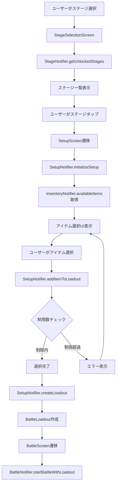
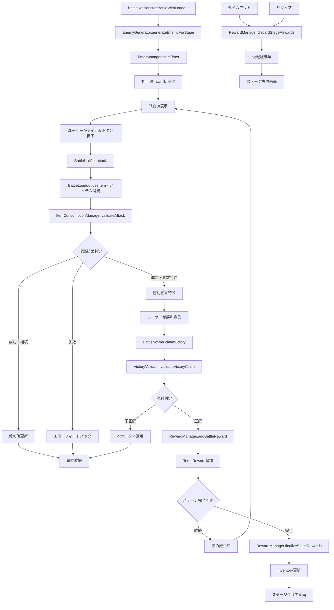
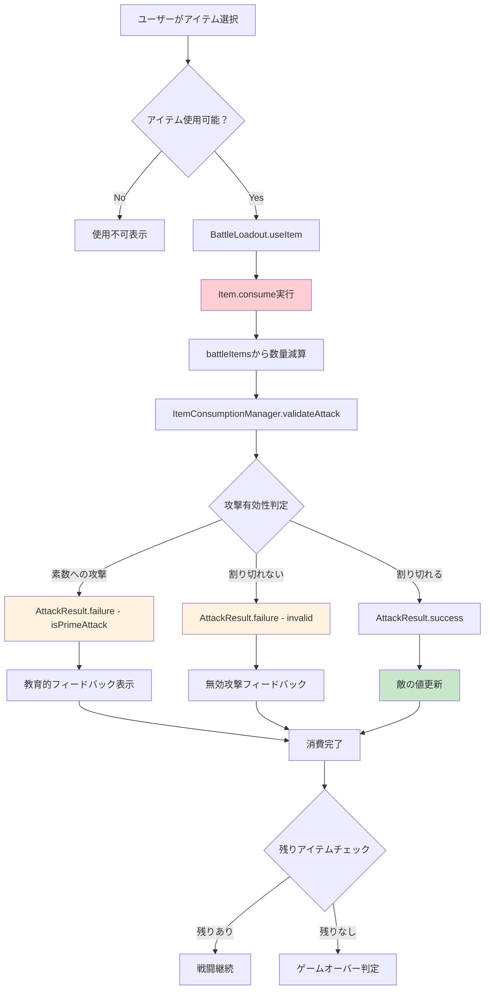

# 合成数ハンター 詳細クラス設計書（修正版 v4）

## 1. クラス図

### 1.1 ドメイン層クラス図

```mermaid
classDiagram
    class Item {
        +int value
        +int count
        +DateTime firstObtained
        +bool isPrime
        +bool isAvailable
        +bool isEmpty
        +Item consume(int amount)
        +Item add(int amount)
        +Item copyWith()
        +bool operator==()
        +int hashCode
    }

    class Stage {
        +int stageNumber
        +String name
        +String description
        +int slotLimit
        +int baseTimeSeconds
        +StageType type
        +StageDifficulty difficulty
        +List~StageReward~ rewards
        +bool isUnlocked
        +bool canChallenge(List~Item~ inventory)
        +Stage copyWith()
    }

    class BattleLoadout {
        +List~Item~ battleItems
        +List~Item~ originalItems
        +int maxSlots
        +Stage targetStage
        +DateTime createdAt
        +bool isFull
        +bool isEmpty
        +bool canContinueBattle
        +int remainingSlots
        +int totalItemCount
        +BattleLoadout useItem(Item item)
        +bool canUseItem(Item item)
        +int getRemainingCount(int itemValue)
        +BattleLoadout copyWith()
    }

    class TempReward {
        +List~Item~ tempItems
        +DateTime battleStartTime
        +bool isFinalized
        +TempReward addTempItem(Item item)
        +TempReward finalize()
        +TempReward discard()
        +int totalTempItems
        +bool hasTempRewards
        +TempReward copyWith()
    }

    class Enemy {
        +int currentValue
        +int originalValue
        +EnemyType type
        +List~int~ primeFactors
        +bool isPowerEnemy
        +int? powerBase
        +int? powerExponent
        +bool isPrime
        +bool isDefeated
        +bool canBeAttackedBy(int value)
        +Enemy attack(int value)
        +Enemy copyWith()
    }

    class TimerState {
        +int remainingSeconds
        +int originalSeconds
        +bool isActive
        +bool isWarning
        +List~TimePenalty~ penalties
        +bool isExpired
        +bool shouldShowWarning
        +int totalPenaltySeconds
        +TimerState applyPenalty(TimePenalty penalty)
        +TimerState tick()
        +TimerState copyWith()
    }

    class TimePenalty {
        +int seconds
        +PenaltyType type
        +DateTime appliedAt
    }

    class VictoryClaim {
        +int claimedValue
        +DateTime claimedAt
        +bool isCorrect
        +int? rewardPrime
        +VictoryClaim copyWith()
    }

    class BattleState {
        +Enemy? currentEnemy
        +BattleLoadout? loadout
        +TempReward tempReward
        +List~Item~ usedItems
        +BattleStatus status
        +int turnCount
        +DateTime? battleStartTime
        +TimerState? timerState
        +VictoryClaim? victoryClaim
        +List~TimePenalty~ battlePenalties
        +Stage? currentStage
        +bool canUseItem(Item item)
        +bool canFight
        +bool canClaimVictory
        +BattleState useItem(Item item)
        +BattleState addTempReward(Item rewardItem)
        +BattleState finalizeRewards()
        +BattleState discardRewards()
        +BattleState copyWith()
    }

    class Inventory {
        +List~Item~ items
        +DateTime lastUpdated
        +bool hasItem(int value)
        +Item? getItem(int value)
        +List~Item~ availableItems
        +Inventory addItem(Item newItem)
        +Inventory addTempRewards(TempReward tempReward)
        +int totalItems
        +int uniqueItems
        +Inventory copyWith()
    }

    BattleState --> Enemy : contains
    BattleState --> BattleLoadout : uses
    BattleState --> TempReward : manages
    BattleState --> Item : tracks
    BattleState --> TimerState : has
    BattleState --> VictoryClaim : has
    BattleState --> TimePenalty : tracks
    BattleState --> Stage : references
    BattleLoadout --> Item : manages
    BattleLoadout --> Stage : targets
    TempReward --> Item : holds
    TimerState --> TimePenalty : applies
    Inventory --> Item : manages
    Stage --> StageReward : contains

    <<enumeration>> EnemyType
    EnemyType : SMALL
    EnemyType : MEDIUM
    EnemyType : LARGE
    EnemyType : POWER
    EnemyType : SPECIAL

    <<enumeration>> BattleStatus
    BattleStatus : WAITING
    BattleStatus : FIGHTING
    BattleStatus : VICTORY
    BattleStatus : STAGE_COMPLETE
    BattleStatus : STAGE_FAILED
    BattleStatus : ESCAPE
    BattleStatus : TIMEOUT

    <<enumeration>> StageType
    StageType : TUTORIAL
    StageType : NORMAL
    StageType : CHALLENGE
    StageType : SPECIAL

    <<enumeration>> StageDifficulty
    StageDifficulty : EASY
    StageDifficulty : NORMAL
    StageDifficulty : HARD
    StageDifficulty : EXTREME

    <<enumeration>> PenaltyType
    PenaltyType : RETIRE
    PenaltyType : WRONG_VICTORY_CLAIM
    PenaltyType : TIMEOUT
    PenaltyType : ITEM_USAGE
```

### 1.2 ビジネスロジック層クラス図

```mermaid
classDiagram
    class BattleEngine {
        +ItemConsumptionManager itemConsumptionManager
        +RewardManager rewardManager
        +VictoryValidator victoryValidator
        +PenaltyCalculator penaltyCalculator
        +Future~BattleResult~ executeAttack(BattleState state, Item item)
        +BattleResult processVictoryClaim(BattleState state, int claimedValue)
        +BattleResult processRetire()
        +BattleResult processTimeOut()
    }

    class ItemConsumptionManager {
        +BattleLoadout consumeItem(BattleLoadout loadout, Item item)
        +AttackResult validateAttack(Enemy enemy, Item item)
        +BattleLoadout createBattleLoadout(Stage stage, List~Item~ selectedItems)
    }

    class RewardManager {
        +TempReward addBattleReward(TempReward currentReward, Enemy defeatedEnemy)
        +TempReward addPowerEnemyReward(TempReward currentReward, PowerEnemy defeatedPowerEnemy)
        +Future~RewardResult~ finalizeStageRewards(TempReward tempReward, Inventory inventory, Stage stage)
        +RewardResult discardStageRewards(TempReward tempReward)
    }

    class SetupManager {
        +BattleLoadout currentLoadout
        +List~Item~ originalSelection
        +BattleLoadout createLoadout(Stage stage, List~Item~ selectedItems)
        +SetupValidationResult validateSelection(Stage stage, List~Item~ selectedItems, List~Item~ inventory)
        +BattleLoadout addItemToLoadout(Item item)
        +BattleLoadout removeItemFromLoadout(Item item)
        +BattleLoadout restoreOriginalLoadout()
    }

    class StageManager {
        +List~Stage~ getAllStages()
        +List~Stage~ getUnlockedStages()
        +Stage? getStage(int stageNumber)
        +bool canChallengeStage(Stage stage, List~Item~ inventory)
        +Stage unlockStage(int stageNumber)
        +List~StageReward~ calculateRewards(Stage stage, BattleResult result)
    }

    class EnemyGenerator {
        -Random _random
        +Enemy generateEnemyForStage(Stage stage)
        +Enemy generateEnemy(List~Item~ playerInventory, int playerLevel)
        -Enemy _generatePowerEnemy(List~Item~ playerInventory, int playerLevel)
        -Enemy _generateNormalEnemy(List~Item~ playerInventory, int playerLevel)
        -int _generateSmallEnemy(List~int~ availableItems)
        -int _generateMediumEnemy(List~int~ availableItems)
        -int _generateLargeEnemy(List~int~ availableItems)
        -int _calculateTargetDifficulty(int playerLevel)
        -List~int~ _getAvailableItems(List~Item~ inventory)
    }

    class PowerEnemyDetector {
        +static bool isPowerEnemy(int value)
        +static PowerEnemyInfo? analyzePowerEnemy(int value)
        +static Enemy createPowerEnemy(int base, int exponent)
    }

    class PowerEnemyInfo {
        +int base
        +int exponent
        +int value
    }

    class TimerManager {
        -Timer? _timer
        -StreamController~TimerState~ _timerController
        -TimerState _currentState
        +Stream~TimerState~ timerStream
        +TimerState currentState
        +void startTimer(int seconds)
        +void stopTimer()
        +void applyPenalty(TimePenalty penalty)
        +void dispose()
        +static int getBaseTimeForStage(Stage stage)
    }

    class VictoryValidator {
        +static VictoryValidationResult validateVictoryClaim(Enemy enemy, int claimedValue)
        +static bool canClaimVictory(Enemy enemy, TimerState timerState)
    }

    class VictoryValidationResult {
        +bool isValid
        +int claimedValue
        +int? rewardPrime
        +TimePenalty? penalty
    }

    class PrimeCalculator {
        +static bool isPrime(int number)
        +static List~int~ factorize(int number)
        +static List~int~ sieveOfEratosthenes(int limit)
        +static bool isPowerOfPrime(int number)
    }

    BattleEngine --> ItemConsumptionManager : uses
    BattleEngine --> RewardManager : uses
    BattleEngine --> VictoryValidator : uses
    BattleEngine --> PenaltyCalculator : uses
    ItemConsumptionManager --> AttackResult : returns
    RewardManager --> RewardResult : returns
    SetupManager --> SetupValidationResult : returns
    EnemyGenerator --> PowerEnemyDetector : uses
    EnemyGenerator --> PrimeCalculator : uses
    PowerEnemyDetector --> PowerEnemyInfo : creates
    PowerEnemyDetector --> PrimeCalculator : uses
    VictoryValidator --> VictoryValidationResult : returns
    VictoryValidator --> PrimeCalculator : uses
    TimerManager --> TimerState : manages
```



### 1.3 プレゼンテーション層クラス図

```mermaid
classDiagram
    class BattleNotifier {
        -BattleEngine _battleEngine
        -EnemyGenerator _enemyGenerator
        -TimerManager _timerManager
        -RewardManager _rewardManager
        -Ref _ref
        +void startBattleWithLoadout(BattleLoadout loadout)
        +Future~void~ attack(Item item)
        +Future~void~ claimVictory()
        +Future~void~ retire()
        -Future~void~ _checkStageCompletion()
        -Future~void~ _completeStage()
        -Future~void~ _discardTempRewards()
        -void _handleTimerUpdate(TimerState timerState)
        -Future~void~ _playAttackAnimation(int itemValue, bool isPrimeReached)
        -Future~void~ _playVictoryAnimation()
        -Future~void~ _playPowerVictoryAnimation()
        -Future~void~ _playPenaltyAnimation()
        -void _showError(String message)
        -void _showPenaltyMessage(String message)
        -void _showStageCompleteMessage(int rewardCount)
        -void _showStageFailedMessage(int lostRewardCount)
    }

    class InventoryNotifier {
        -InventoryRepository _repository
        +void addItem(Item item)
        +void updateInventory(Inventory inventory)
        +void removeItem(int value)
        +Future~void~ loadInventory()
        +Future~void~ saveInventory()
    }

    class SetupNotifier {
        -SetupManager _setupManager
        -StageManager _stageManager
        -Ref _ref
        +void initializeSetup(Stage stage)
        +void addItemToLoadout(Item item)
        +void removeItemFromLoadout(Item item)
        +BattleLoadout? createLoadout()
        +void resetSetup()
    }

    class StageNotifier {
        -StageManager _stageManager
        +void initializeStages()
        +void unlockStage(int stageNumber)
        +void updateStageProgress(int stageNumber, BattleResult result)
        +Future~void~ loadStageData()
        +Future~void~ saveStageData()
    }

    class TempRewardNotifier {
        -RewardManager _rewardManager
        +void initializeTempReward()
        +void addTempItem(Item item)
        +void clearTempRewards()
    }

    class GameNotifier {
        -GameRepository _repository
        +void levelUp()
        +void addExperience(int exp)
        +void updateStatistics(BattleResult result)
        +Future~void~ loadGameData()
        +Future~void~ saveGameData()
    }

    class TimerNotifier {
        -TimerManager _timerManager
        +void startTimer(int seconds)
        +void stopTimer()
        +void pauseTimer()
        +void resumeTimer()
        +Stream~TimerState~ get timerStream
    }

    class StageSelectionScreen {
        +Widget build(BuildContext context)
        -Widget _buildStageCard(Stage stage)
        -Widget _buildStageList()
        -Widget _buildProgressIndicator()
        -void _goToSetupScreen(Stage stage)
        -void _startPracticeMode()
    }

    class SetupScreen {
        +Stage targetStage
        +Widget build(BuildContext context)
        -Widget _buildItemSelector()
        -Widget _buildLoadoutDisplay()
        -Widget _buildSlotLimitIndicator()
        -Widget _buildStartBattleButton()
        -void _selectItem(Item item)
        -void _startBattle()
    }

    class BattleScreen {
        +Widget build(BuildContext context)
        -Widget _buildEnemyDisplay()
        -Widget _buildBattleItemsGrid()
        -Widget _buildActionButtons()
        -Widget _buildTimerDisplay()
        -Widget _buildTempRewardsDisplay()
        -Widget _buildVictoryClaimButton()
    }

    class EnemyWidget {
        +Enemy enemy
        +Widget build(BuildContext context)
        -Widget _buildNormalEnemy()
        -Widget _buildPowerEnemy()
        -Widget _buildEnemyValue()
        -Widget _buildEnemyType()
    }

    class BattleItemsGridWidget {
        +List~Item~ battleItems
        +Function(Item) onItemTap
        +Widget build(BuildContext context)
        -Widget _buildItemCard(Item item)
        -Widget _buildItemCount(Item item)
        -Widget _buildUsageIndicator(Item item)
    }

    class TempRewardsWidget {
        +TempReward tempReward
        +Widget build(BuildContext context)
        -Widget _buildRewardList()
        -Widget _buildRewardItem(Item item)
        -Widget _buildTotalCount()
    }

    class TimerWidget {
        +TimerState timerState
        +Widget build(BuildContext context)
        -Widget _buildTimeDisplay()
        -Widget _buildWarningIndicator()
        -Widget _buildProgressBar()
    }

    class VictoryClaimButton {
        +bool canClaim
        +VoidCallback onPressed
        +Widget build(BuildContext context)
    }

    BattleNotifier --> StateNotifier : extends
    InventoryNotifier --> StateNotifier : extends
    SetupNotifier --> StateNotifier : extends
    StageNotifier --> StateNotifier : extends
    TempRewardNotifier --> StateNotifier : extends
    GameNotifier --> StateNotifier : extends
    TimerNotifier --> StateNotifier : extends

    StageSelectionScreen --> StageNotifier : watches
    SetupScreen --> SetupNotifier : watches
    SetupScreen --> InventoryNotifier : watches
    BattleScreen --> BattleNotifier : watches
    BattleScreen --> TempRewardNotifier : watches
    BattleScreen --> EnemyWidget : contains
    BattleScreen --> BattleItemsGridWidget : contains
    BattleScreen --> TempRewardsWidget : contains
    BattleScreen --> TimerWidget : contains
    BattleScreen --> VictoryClaimButton : contains

    EnemyWidget --> Enemy : displays
    BattleItemsGridWidget --> Item : displays
    TempRewardsWidget --> TempReward : displays
    TimerWidget --> TimerState : displays
```



## 2. メソッド仕様

### 2.1 Item クラス

#### consume(int amount) → Item

```dart
/// アイテムを消費する
///
/// Parameters:
///   - amount: 消費する数量
///
/// Returns:
///   - 消費後のアイテム状態
///
/// Throws:
///   - ItemException: 所持数が不足している場合
///
/// Preconditions:
///   - amount > 0
///   - count >= amount
///
/// Postconditions:
///   - 戻り値のcount == 元のcount - amount
///   - valueとfirstObtainedは変更されない
```

#### add(int amount) → Item

```dart
/// アイテムを追加する
///
/// Parameters:
///   - amount: 追加する数量
///
/// Returns:
///   - 追加後のアイテム状態
///
/// Preconditions:
///   - amount > 0
///
/// Postconditions:
///   - 戻り値のcount == 元のcount + amount
```

### 2.2 BattleLoadout クラス

#### useItem(Item item) → BattleLoadout

```dart
/// 戦闘中にアイテムを使用する
///
/// Parameters:
///   - item: 使用するアイテム
///
/// Returns:
///   - アイテム使用後のロードアウト状態
///
/// Throws:
///   - ItemException: アイテムが見つからない、または残数不足の場合
///
/// Business Rules:
///   - 攻撃の成功/失敗に関わらずアイテムは消費される
///   - 残数が0になったアイテムは使用不可になる
```

#### canUseItem(Item item) → bool

```dart
/// アイテムが使用可能かを判定
///
/// Parameters:
///   - item: 判定対象のアイテム
///
/// Returns:
///   - true: 使用可能, false: 使用不可能
///
/// Business Rules:
///   - バトルロードアウトに含まれ、かつ残数が1以上の場合のみ使用可能
```

### 2.3 TempReward クラス

#### addTempItem(Item item) → TempReward

```dart
/// 仮報酬にアイテムを追加する
///
/// Parameters:
///   - item: 追加するアイテム
///
/// Returns:
///   - アイテム追加後の仮報酬状態
///
/// Throws:
///   - RewardException: 既に確定済みの場合
///
/// Business Rules:
///   - 同じ値のアイテムが既に存在する場合は数量を合算
///   - 確定済み(isFinalized=true)の場合は追加不可
```

#### finalize() → TempReward

```dart
/// 仮報酬を確定状態にする
///
/// Returns:
///   - 確定状態の仮報酬
///
/// Business Rules:
///   - 一度確定した仮報酬は変更不可
///   - ステージクリア時のみ呼び出される
```

#### discard() → TempReward

```dart
/// 仮報酬を破棄する
///
/// Returns:
///   - 破棄状態の仮報酬
///
/// Business Rules:
///   - ステージ失敗時（タイムアウト・リタイア）に呼び出される
///   - 破棄されたアイテムはインベントリに追加されない
```

### 2.4 ItemConsumptionManager クラス

#### consumeItem(BattleLoadout loadout, Item item) → BattleLoadout

```dart
/// アイテム消費処理（成功/失敗に関わらず消費）
///
/// Parameters:
///   - loadout: 現在のバトルロードアウト
///   - item: 消費するアイテム
///
/// Returns:
///   - アイテム消費後のロードアウト
///
/// Throws:
///   - ItemException: アイテムが使用不可能な場合
///
/// Business Rules:
///   - 攻撃の成功/失敗に関わらずアイテムは必ず消費される
///   - 消費処理と攻撃判定は分離されている
```

#### validateAttack(Enemy enemy, Item item) → AttackResult

```dart
/// 攻撃の有効性を判定（消費は別途実行）
///
/// Parameters:
///   - enemy: 攻撃対象の敵
///   - item: 使用するアイテム
///
/// Returns:
///   - AttackResult: 攻撃結果のUnion Type
///
/// Business Rules:
///   - 素数への攻撃は必ず失敗
///   - 割り切れない場合は失敗
///   - 攻撃判定と消費処理は独立
```

### 2.5 RewardManager クラス

#### finalizeStageRewards(TempReward tempReward, Inventory inventory, Stage stage) → Future<RewardResult>

```dart
/// ステージクリア時の報酬確定処理
///
/// Parameters:
///   - tempReward: 確定対象の仮報酬
///   - inventory: 現在のインベントリ
///   - stage: クリアしたステージ
///
/// Returns:
///   - RewardResult: 確定結果
///
/// Side Effects:
///   - 仮報酬をインベントリに追加
///   - ステージ基本報酬も追加
///   - 確定アニメーションを再生
///
/// Business Rules:
///   - ステージクリア時のみ呼び出される
///   - 仮報酬とステージ報酬の両方を処理
```

#### discardStageRewards(TempReward tempReward) → RewardResult

```dart
/// ステージ失敗時の報酬破棄処理
///
/// Parameters:
///   - tempReward: 破棄対象の仮報酬
///
/// Returns:
///   - RewardResult: 破棄結果
///
/// Business Rules:
///   - タイムアウト・リタイア時に呼び出される
///   - 破棄されたアイテム数を記録
```

### 2.6 BattleNotifier クラス

#### attack(Item item) → Future<void>

```dart
/// 戦闘画面でのアイテム使用アクションを処理
///
/// Parameters:
///   - item: 使用するアイテム
///
/// Side Effects:
///   - アイテムを必ず消費（成功/失敗問わず）
///   - 攻撃アニメーションを再生
///   - 戦闘状態を更新
///   - 素数到達時は勝利宣言待ち状態に移行
///
/// Async Operations:
///   - アニメーション再生 (500ms)
///   - 状態の永続化
///
/// Business Rules:
///   - 素数への攻撃も実行可能（教育効果のため）
///   - 無効攻撃でもアイテムは消費される
```

#### claimVictory() → Future<void>

```dart
/// 勝利宣言を処理
///
/// Side Effects:
///   - 勝利判定を実行
///   - 正解の場合: 勝利アニメーション + 仮報酬追加
///   - 不正解の場合: ペナルティアニメーション + タイム減少
///   - タイマー管理
///   - ステージ完了判定
///
/// Preconditions:
///   - canClaimVictory == true
///
/// Business Rules:
///   - 仮報酬として一時保存
///   - ステージクリア時に確定処理
```

#### retire() → Future<void>

```dart
/// リタイア処理
///
/// Side Effects:
///   - ペナルティ記録
///   - 仮報酬破棄
///   - タイマー停止
///   - 次回ステージのペナルティ設定
///
/// Business Rules:
///   - 獲得していた仮報酬は全て失われる
///   - 次回同ステージ挑戦時の制限時間が短縮される
```

## 3. データフロー図

### 3.1 ステージ挑戦フロー（修正版）



### 3.2 戦闘フロー（修正版）



### 3.3 仮報酬管理フロー（新規）

```mermaid
flowchart TD
    A[戦闘開始] --> B[TempReward初期化]
    B --> C[tempItems = []]
    C --> D[戦闘実行]

    D --> E[敵撃破]
    D --> E[敵撃破]
E --> F{敵タイプ判定}

F -->|通常敵| G[TempReward.addTempItem]
F -->|累乗敵| H[TempReward.addTempItem - 複数個]

G --> I[仮報酬リストに追加]
H --> I
I --> J[TempRewardsWidget更新]
J --> K{ステージ継続？}

K -->|継続| L[次の敵]
K -->|完了| M[ステージクリア判定]

L --> D
M --> N[RewardManager.finalizeStageRewards]
N --> O[TempReward.finalize]
O --> P[Inventory.addTempRewards]
P --> Q[確定アニメーション]
Q --> R[ステージクリア]

S[タイムアウト/リタイア] --> T[RewardManager.discardStageRewards]
T --> U[TempReward.discard]
U --> V[破棄アニメーション]
V --> W[ステージ失敗]

style I fill:#e1f5fe
style P fill:#c8e6c9
style U fill:#ffcdd2
```

### 3.4 アイテム消費フロー（新規）



### 3.5 ステージ管理フロー（新規）

```marmaid
mermaidflowchart TD
    A[アプリ起動] --> B[StageManager.getAllStages]
    B --> C[デフォルトステージ読み込み]
    C --> D[StageNotifier.initializeStages]
    D --> E[解放状況確認]

    E --> F[ステージ1: 常に解放]
    F --> G[ステージ2以降: 条件チェック]
    G --> H[StageSelectionScreen表示]

    I[ステージクリア] --> J[StageManager.calculateRewards]
    J --> K[報酬計算]
    K --> L{次ステージ解放条件}

    L -->|条件満たす| M[StageManager.unlockStage]
    L -->|条件不足| N[現状維持]

    M --> O[Stage.isUnlocked = true]
    O --> P[解放アニメーション]
    P --> Q[ステージリスト更新]

    N --> R[ステージリスト更新]
    Q --> R
    R --> S[次回表示時に反映]

    style M fill:#c8e6c9
    style P fill:#e1f5fe
```

## 4. UI 画面遷移図（修正版）

### 4.1 全体画面遷移

```marmaid
mermaidstateDiagram-v2
    [*] --> SplashScreen : アプリ起動

    SplashScreen --> TutorialScreen : 初回起動
    SplashScreen --> StageSelectionScreen : 通常起動

    TutorialScreen --> StageSelectionScreen : チュートリアル完了

    StageSelectionScreen --> SetupScreen : ステージ選択
    StageSelectionScreen --> BattleScreen : 練習モード選択
    StageSelectionScreen --> InventoryScreen : インベントリタップ
    StageSelectionScreen --> AchievementScreen : 実績タップ

    SetupScreen --> StageSelectionScreen : 戻るボタン
    SetupScreen --> BattleScreen : 戦闘開始

    BattleScreen --> StageSelectionScreen : 戻るボタン
    BattleScreen --> InventoryScreen : インベントリタップ
    BattleScreen --> AchievementScreen : 実績タップ
    BattleScreen --> StageCompleteScreen : ステージクリア
    BattleScreen --> StageFailedScreen : ステージ失敗

    StageCompleteScreen --> StageSelectionScreen : 戻る
    StageFailedScreen --> StageSelectionScreen : 戻る
    StageFailedScreen --> SetupScreen : 再挑戦

    InventoryScreen --> StageSelectionScreen : 戻るボタン
    AchievementScreen --> StageSelectionScreen : 戻るボタン

    state BattleScreen {
        [*] --> InitializingState
        InitializingState --> FightingState : 戦闘開始
        FightingState --> FightingState : アイテム使用継続
        FightingState --> AwaitingClaimState : 素数到達
        AwaitingClaimState --> FightingState : 勝利宣言失敗
        AwaitingClaimState --> VictoryState : 勝利宣言成功
        FightingState --> RetiredState : リタイア選択
        FightingState --> TimeOutState : 時間切れ
        AwaitingClaimState --> TimeOutState : 時間切れ
        VictoryState --> InitializingState : 次の敵（継続）
        VictoryState --> StageCompleteState : ステージクリア
        RetiredState --> StageFailedState : 失敗処理
        TimeOutState --> StageFailedState : 失敗処理
        StageCompleteState --> [*] : クリア画面
        StageFailedState --> [*] : 失敗画面
    }

    state SetupScreen {
        [*] --> ItemSelectionState
        ItemSelectionState --> ItemSelectionState : アイテム選択/解除
        ItemSelectionState --> ValidationState : 選択完了
        ValidationState --> ItemSelectionState : 検証失敗
        ValidationState --> LoadoutCreatedState : 検証成功
        LoadoutCreatedState --> [*] : 戦闘開始
    }
```

### 4.2 戦闘画面状態遷移詳細（修正版）

```marmaid
mermaidstateDiagram-v2
    [*] --> Waiting : 初期状態

    Waiting --> Fighting : startBattleWithLoadout()
    note right of Fighting : タイマー開始\n敵表示\nバトルアイテム表示\n仮報酬初期化

    Fighting --> Fighting : attack() - 継続
    note left of Fighting : アイテム消費\n攻撃アニメーション\n敵の値更新

    Fighting --> AwaitingClaim : attack() - 素数到達
    note right of AwaitingClaim : 勝利宣言ボタン表示\nタイマー継続\nアイテム消費済み

    AwaitingClaim --> TempRewardAdded : claimVictory() - 正解
    note right of TempRewardAdded : 仮報酬追加\n勝利アニメーション\nステージ完了判定

    AwaitingClaim --> Fighting : claimVictory() - 不正解
    note left of AwaitingClaim : ペナルティアニメーション\nタイマー減少

    TempRewardAdded --> Fighting : 次の敵
    TempRewardAdded --> StageComplete : ステージクリア

    Fighting --> Retired : retire()
    AwaitingClaim --> Retired : retire()
    note left of Retired : 仮報酬破棄\nペナルティ記録

    Fighting --> TimeOut : タイマー満了
    AwaitingClaim --> TimeOut : タイマー満了
    note right of TimeOut : 仮報酬破棄\nペナルティ記録

    StageComplete --> RewardFinalized : finalizeStageRewards()
    note right of RewardFinalized : 仮報酬確定\nインベントリ更新\n確定アニメーション

    Retired --> RewardDiscarded : discardStageRewards()
    TimeOut --> RewardDiscarded : discardStageRewards()
    note left of RewardDiscarded : 仮報酬破棄\n破棄アニメーション

    RewardFinalized --> Waiting : 次ステージ準備
    RewardDiscarded --> Waiting : 再挑戦準備

    state TempRewardAdded {
        [*] --> NormalReward
        [*] --> PowerReward

        NormalReward : 通常報酬\nアイテム × 1個
        PowerReward : 特別報酬\nbase × exponent個
    }
```

### 4.3 アイテム選択画面状態（新規）

```marmaid
mermaidstateDiagram-v2
    [*] --> ItemSelection : セットアップ開始

    ItemSelection --> ItemSelection : アイテム選択/解除
    note right of ItemSelection : 制限数チェック\n選択状況表示\n残り枠表示

    ItemSelection --> SlotLimitReached : 制限数到達
    note right of SlotLimitReached : 追加選択不可\n選択解除のみ可能

    SlotLimitReached --> ItemSelection : アイテム解除

    ItemSelection --> ValidationPassed : 最小選択数満たす
    SlotLimitReached --> ValidationPassed : 最小選択数満たす
    note right of ValidationPassed : 戦闘開始ボタン有効\nロードアウト作成可能

    ValidationPassed --> ItemSelection : アイテム解除で最小数未満
    ValidationPassed --> LoadoutCreated : 戦闘開始

    LoadoutCreated --> [*] : 戦闘画面遷移

    state ItemSelection {
        [*] --> InsufficientSelection
        InsufficientSelection : 選択数不足\n戦闘開始不可
        InsufficientSelection --> SufficientSelection : 最小数達成
        SufficientSelection : 選択数十分\n戦闘開始可能
        SufficientSelection --> InsufficientSelection : 選択数減少
    }
4.4 仮報酬UI状態（新規）
mermaidstateDiagram-v2
    [*] --> Empty : 仮報酬なし

    Empty --> HasTempRewards : 初回報酬獲得
    note right of HasTempRewards : 仮報酬リスト表示\n獲得アニメーション\n総数表示

    HasTempRewards --> HasTempRewards : 追加報酬獲得
    note left of HasTempRewards : リスト更新\n総数増加\n新規アイテム強調

    HasTempRewards --> Finalizing : ステージクリア
    note right of Finalizing : 確定プロセス開始\n確定アニメーション準備

    HasTempRewards --> Discarding : ステージ失敗
    note left of Discarding : 破棄プロセス開始\n破棄アニメーション準備

    Finalizing --> Finalized : 確定完了
    note right of Finalized : 成功メッセージ表示\nインベントリ反映\n確定演出

    Discarding --> Discarded : 破棄完了
    note left of Discarded : 失敗メッセージ表示\n失ったアイテム数表示\n破棄演出

    Finalized --> Empty : 新ステージ開始
    Discarded --> Empty : 再挑戦・他ステージ

    state HasTempRewards {
        [*] --> SingleType
        SingleType : 単一種類\n同じアイテムのみ
        SingleType --> MultipleTypes : 異なるアイテム獲得
        MultipleTypes : 複数種類\n多様なアイテム
        MultipleTypes --> SingleType : 統合・整理
    }
```

## 5. 状態管理フロー（修正版）

### 5.1 Riverpod プロバイダー依存関係（修正版）

```marmaid
mermaidgraph TD
    A[gameDataProvider] --> B[battleProvider]
    A --> C[inventoryProvider]
    A --> D[achievementProvider]
    A --> E[stageProvider]

    F[timerManagerProvider] --> G[timerProvider]
    G --> B

    H[battleEngineProvider] --> B
    I[enemyGeneratorProvider] --> B
    J[itemConsumptionManagerProvider] --> B
    K[rewardManagerProvider] --> B
    K --> L[tempRewardProvider]

    M[setupManagerProvider] --> N[setupProvider]
    O[stageManagerProvider] --> E
    O --> N

    C --> P[availableItemsProvider]
    C --> Q[itemCountProvider]

    B --> R[canClaimVictoryProvider]
    B --> S[canUseItemProvider]
    B --> T[currentEnemyProvider]
    B --> U[battleItemsRemainingProvider]

    L --> V[tempRewardCountProvider]
    L --> W[hasTempRewardsProvider]

    E --> X[unlockedStagesProvider]
    E --> Y[currentStageInfoProvider]

    N --> Z[canStartBattleProvider]
    N --> AA[canAddToBattleLoadoutProvider]
    N --> BB[currentLoadoutInfoProvider]

    B --> CC[battleStatusProvider]
    CC --> DD[uiStateProvider]

    G --> EE[timeWarningProvider]
    EE --> DD
```

### 5.2 状態更新シーケンス（修正版）

```marmaid
mermaidsequenceDiagram
    participant User
    participant SetupScreen
    participant SetupNotifier
    participant BattleScreen
    participant BattleNotifier
    participant ItemConsumptionManager
    participant RewardManager
    participant InventoryNotifier
    participant TempRewardNotifier

    User->>SetupScreen: ステージ選択
    SetupScreen->>SetupNotifier: initializeSetup(stage)
    SetupNotifier-->>SetupScreen: 初期化完了

    User->>SetupScreen: アイテム選択
    SetupScreen->>SetupNotifier: addItemToLoadout(item)
    SetupNotifier-->>SetupScreen: 選択状態更新

    User->>SetupScreen: 戦闘開始
    SetupScreen->>SetupNotifier: createLoadout()
    SetupNotifier-->>SetupScreen: BattleLoadout作成

    SetupScreen->>BattleScreen: 画面遷移
    BattleScreen->>BattleNotifier: startBattleWithLoadout(loadout)
    BattleNotifier->>TempRewardNotifier: initializeTempReward()

    User->>BattleScreen: アイテム使用
    BattleScreen->>BattleNotifier: attack(item)
    BattleNotifier->>ItemConsumptionManager: consumeItem(loadout, item)
    ItemConsumptionManager-->>BattleNotifier: 消費完了
    BattleNotifier->>ItemConsumptionManager: validateAttack(enemy, item)
    ItemConsumptionManager-->>BattleNotifier: AttackResult

    alt 攻撃成功・勝利
        BattleNotifier->>RewardManager: addBattleReward(tempReward, enemy)
        RewardManager-->>BattleNotifier: 仮報酬追加
        BattleNotifier->>TempRewardNotifier: addTempItem(rewardItem)
        TempRewardNotifier-->>BattleScreen: 仮報酬表示更新

        BattleNotifier->>RewardManager: finalizeStageRewards(tempReward, inventory, stage)
        RewardManager->>InventoryNotifier: addTempRewards(finalizedReward)
        InventoryNotifier-->>BattleScreen: インベントリ更新

    else 攻撃失敗・タイムアウト
        BattleNotifier->>RewardManager: discardStageRewards(tempReward)
        RewardManager-->>BattleNotifier: 破棄完了
        BattleNotifier->>TempRewardNotifier: clearTempRewards()
    end
```

## 6. アイテム選択画面の詳細設計（修正版）

### 6.1 SetupScreen クラス（修正版）

```dart
dartclass SetupScreen extends ConsumerStatefulWidget {
  final Stage targetStage;

  const SetupScreen({
    super.key,
    required this.targetStage,
  });

  @override
  ConsumerState<SetupScreen> createState() => _SetupScreenState();
}

class _SetupScreenState extends ConsumerState<SetupScreen> {
  @override
  void initState() {
    super.initState();
    // セットアップ初期化
    WidgetsBinding.instance.addPostFrameCallback((_) {
      ref.read(setupProvider.notifier).initializeSetup(widget.targetStage);
    });
  }

  @override
  Widget build(BuildContext context) {
    final setupState = ref.watch(setupProvider);
    final availableItems = ref.watch(availableItemsProvider);

    return Scaffold(
      appBar: AppBar(
        title: Text('${widget.targetStage.name} - アイテム選択'),
        actions: [
          _buildSlotLimitIndicator(setupState),
        ],
      ),
      body: Column(
        children: [
          _buildStageInfo(),
          _buildSelectedItemsDisplay(setupState),
          Expanded(
            child: _buildAvailableItemsList(availableItems, setupState),
          ),
        ],
      ),
      bottomNavigationBar: _buildBottomBar(setupState),
    );
  }

  /// ステージ情報表示
  Widget _buildStageInfo() {
    return Card(
      margin: const EdgeInsets.all(16),
      child: Padding(
        padding: const EdgeInsets.all(16),
        child: Column(
          crossAxisAlignment: CrossAxisAlignment.start,
          children: [
            Text(
              widget.targetStage.name,
              style: Theme.of(context).textTheme.headlineSmall,
            ),
            const SizedBox(height: 8),
            Text(widget.targetStage.description),
            const SizedBox(height: 8),
            Row(
              children: [
                Icon(Icons.timer, size: 16),
                const SizedBox(width: 4),
                Text('制限時間: ${widget.targetStage.baseTimeSeconds}秒'),
                const SizedBox(width: 16),
                Icon(Icons.inventory, size: 16),
                const SizedBox(width: 4),
                Text('持込制限: ${widget.targetStage.slotLimit}個'),
              ],
            ),
          ],
        ),
      ),
    );
  }

  /// 選択済みアイテム表示
  Widget _buildSelectedItemsDisplay(SetupState setupState) {
    return Card(
      margin: const EdgeInsets.symmetric(horizontal: 16),
      child: Padding(
        padding: const EdgeInsets.all(16),
        child: Column(
          crossAxisAlignment: CrossAxisAlignment.start,
          children: [
            Text(
              '選択中のアイテム (${setupState.selectedItems.length}/${setupState.maxSlots})',
              style: Theme.of(context).textTheme.titleMedium,
            ),
            const SizedBox(height: 8),
            if (setupState.selectedItems.isEmpty)
              const Text('アイテムを選択してください')
            else
              Wrap(
                spacing: 8,
                children: setupState.selectedItems.map((item) {
                  return Chip(
                    label: Text('${item.value} × ${item.count}'),
                    onDeleted: () => _removeItemFromLoadout(item),
                    deleteIcon: const Icon(Icons.close, size: 16),
                  );
                }).toList(),
              ),
          ],
        ),
      ),
    );
  }

  /// 利用可能アイテム一覧
  Widget _buildAvailableItemsList(List<Item> availableItems, SetupState setupState) {
    return ListView.builder(
      padding: const EdgeInsets.all(16),
      itemCount: availableItems.length,
      itemBuilder: (context, index) {
        final item = availableItems[index];
        final isSelected = setupState.selectedItems.any((selected) => selected.value == item.value);
        final canAdd = !setupState.isFull && !isSelected && item.isAvailable;

        return Card(
          child: ListTile(
            leading: CircleAvatar(
              backgroundColor: _getItemColor(item),
              child: Text(
                item.value.toString(),
                style: const TextStyle(
                  color: Colors.white,
                  fontWeight: FontWeight.bold,
                ),
              ),
            ),
            title: Text('素数 ${item.value}'),
            subtitle: Text('所持数: ${item.count}個'),
            trailing: isSelected
                ? const Icon(Icons.check_circle, color: Colors.green)
                : canAdd
                    ? IconButton(
                        icon: const Icon(Icons.add_circle_outline),
                        onPressed: () => _addItemToLoadout(item),
                      )
                    : Icon(
                        Icons.block,
                        color: Colors.grey.shade400,
                      ),
            enabled: canAdd || isSelected,
            onTap: isSelected
                ? () => _removeItemFromLoadout(item)
                : canAdd
                    ? () => _addItemToLoadout(item)
                    : null,
          ),
        );
      },
    );
  }

  /// スロット制限インジケーター
  Widget _buildSlotLimitIndicator(SetupState setupState) {
    final progress = setupState.selectedItems.length / setupState.maxSlots;
    final color = progress >= 1.0 ? Colors.red :
                  progress >= 0.8 ? Colors.orange : Colors.green;

    return Padding(
      padding: const EdgeInsets.only(right: 16),
      child: Column(
        mainAxisSize: MainAxisSize.min,
        children: [
          CircularProgressIndicator(
            value: progress,
            color: color,
            backgroundColor: Colors.grey.shade300,
          ),
          const SizedBox(height: 4),
          Text(
            '${setupState.selectedItems.length}/${setupState.maxSlots}',
            style: TextStyle(fontSize: 12, color: color),
          ),
        ],
      ),
    );
  }

  /// 底部バー（戦闘開始ボタンなど）
  Widget _buildBottomBar(SetupState setupState) {
    return Container(
      padding: const EdgeInsets.all(16),
      decoration: BoxDecoration(
        color: Theme.of(context).cardColor,
        boxShadow: [
          BoxShadow(
            offset: const Offset(0, -2),
            blurRadius: 4,
            color: Colors.black.withOpacity(0.1),
          ),
        ],
      ),
      child: SafeArea(
        child: Row(
          children: [
            Expanded(
              child: Column(
                mainAxisSize: MainAxisSize.min,
                crossAxisAlignment: CrossAxisAlignment.start,
                children: [
                  if (setupState.errorMessage != null)
                    Text(
                      setupState.errorMessage!,
                      style: TextStyle(
                        color: Theme.of(context).colorScheme.error,
                        fontSize: 12,
                      ),
                    ),
                  Text(
                    setupState.isValid
                        ? '戦闘開始の準備ができました'
                        : 'アイテムを${setupState.maxSlots > 0 ? '1個以上' : ''}選択してください',
                    style: TextStyle(
                      color: setupState.isValid ? Colors.green : Colors.grey,
                      fontSize: 12,
                    ),
                  ),
                ],
              ),
            ),
            const SizedBox(width: 16),
            ElevatedButton.icon(
              onPressed: setupState.isValid ? _startBattle : null,
              icon: const Icon(Icons.play_arrow),
              label: const Text('戦闘開始'),
            ),
          ],
        ),
      ),
    );
  }

  /// アイテムをロードアウトに追加
  void _addItemToLoadout(Item item) {
    ref.read(setupProvider.notifier).addItemToLoadout(item);
  }

  /// アイテムをロードアウトから削除
  void _removeItemFromLoadout(Item item) {
    ref.read(setupProvider.notifier).removeItemFromLoadout(item);
  }

  /// 戦闘開始処理
  void _startBattle() {
    final loadout = ref.read(setupProvider.notifier).createLoadout();
    if (loadout != null) {
      // 戦闘画面に遷移
      AppRouter.goToBattleWithLoadout(context, loadout);
    }
  }

  /// アイテムの色を取得
  Color _getItemColor(Item item) {
    // 素数値に応じた色分け
    if (item.value <= 10) return Colors.blue;
    if (item.value <= 50) return Colors.green;
    if (item.value <= 100) return Colors.orange;
    return Colors.purple;
  }
}
```

## 6.2 アイテム消費システムの教育的配慮（修正版）

### 6.2.1 消費の視覚的フィードバック

```dart
// BattleItemsGridWidget での残数表示
Widget _buildItemCard(Item item) {
  final remaining = ref.watch(itemRemainingCountProvider(item.value));
  final canUse = remaining > 0;

  return Card(
    color: canUse ? null : Colors.grey.shade300,
    child: InkWell(
      onTap: canUse ? () => widget.onItemTap(item) : null,
      child: Padding(
        padding: const EdgeInsets.all(8),
        child: Column(
          children: [
            Text(
              item.value.toString(),
              style: TextStyle(
                fontSize: 18,
                fontWeight: FontWeight.bold,
                color: canUse ? null : Colors.grey,
              ),
            ),
            const SizedBox(height: 4),
            _buildRemainingCounter(remaining, canUse),
            if (!canUse)
              const Icon(
                Icons.block,
                color: Colors.red,
                size: 16,
              ),
          ],
        ),
      ),
    ),
  );
}

Widget _buildRemainingCounter(int remaining, bool canUse) {
  return Container(
    padding: const EdgeInsets.symmetric(horizontal: 6, vertical: 2),
    decoration: BoxDecoration(
      color: canUse ? Colors.blue : Colors.grey,
      borderRadius: BorderRadius.circular(10),
    ),
    child: Text(
      'あと$remaining個',
      style: const TextStyle(
        color: Colors.white,
        fontSize: 10,
      ),
    ),
  );
}
```

### 6.2.2 消費アニメーション

```dart
// アイテム消費時のアニメーション効果
class ItemConsumptionAnimation extends StatefulWidget {
  final Item item;
  final VoidCallback onComplete;

  const ItemConsumptionAnimation({
    super.key,
    required this.item,
    required this.onComplete,
  });

  @override
  State<ItemConsumptionAnimation> createState() => _ItemConsumptionAnimationState();
}

class _ItemConsumptionAnimationState extends State<ItemConsumptionAnimation>
    with SingleTickerProviderStateMixin {
  late AnimationController _controller;
  late Animation<double> _scaleAnimation;
  late Animation<double> _opacityAnimation;

  @override
  void initState() {
    super.initState();
    _controller = AnimationController(
      duration: const Duration(milliseconds: 600),
      vsync: this,
    );

    _scaleAnimation = Tween<double>(
      begin: 1.0,
      end: 0.8,
    ).animate(CurvedAnimation(
      parent: _controller,
      curve: Curves.easeInOut,
    ));

    _opacityAnimation = Tween<double>(
      begin: 1.0,
      end: 0.3,
    ).animate(CurvedAnimation(
      parent: _controller,
      curve: Curves.easeInOut,
    ));
```
