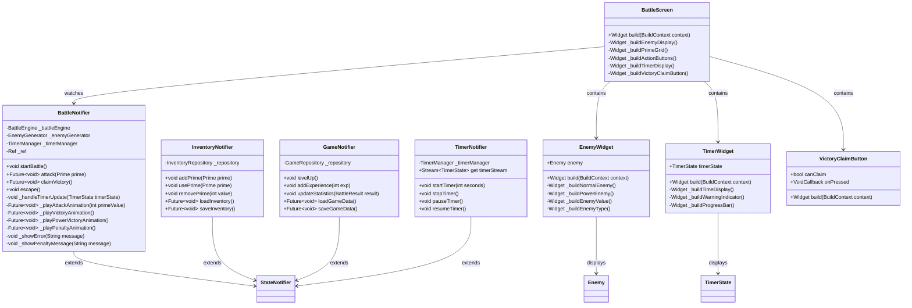
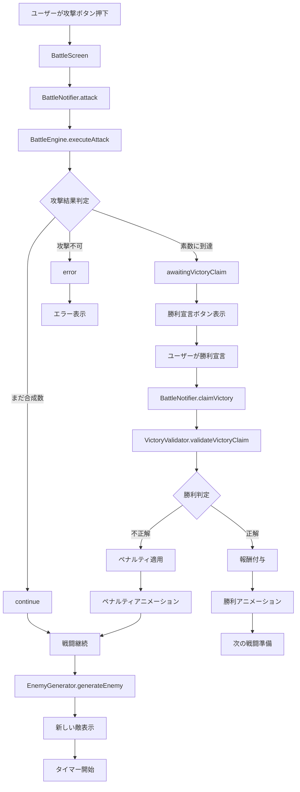
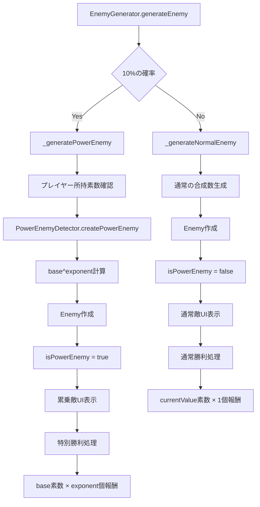
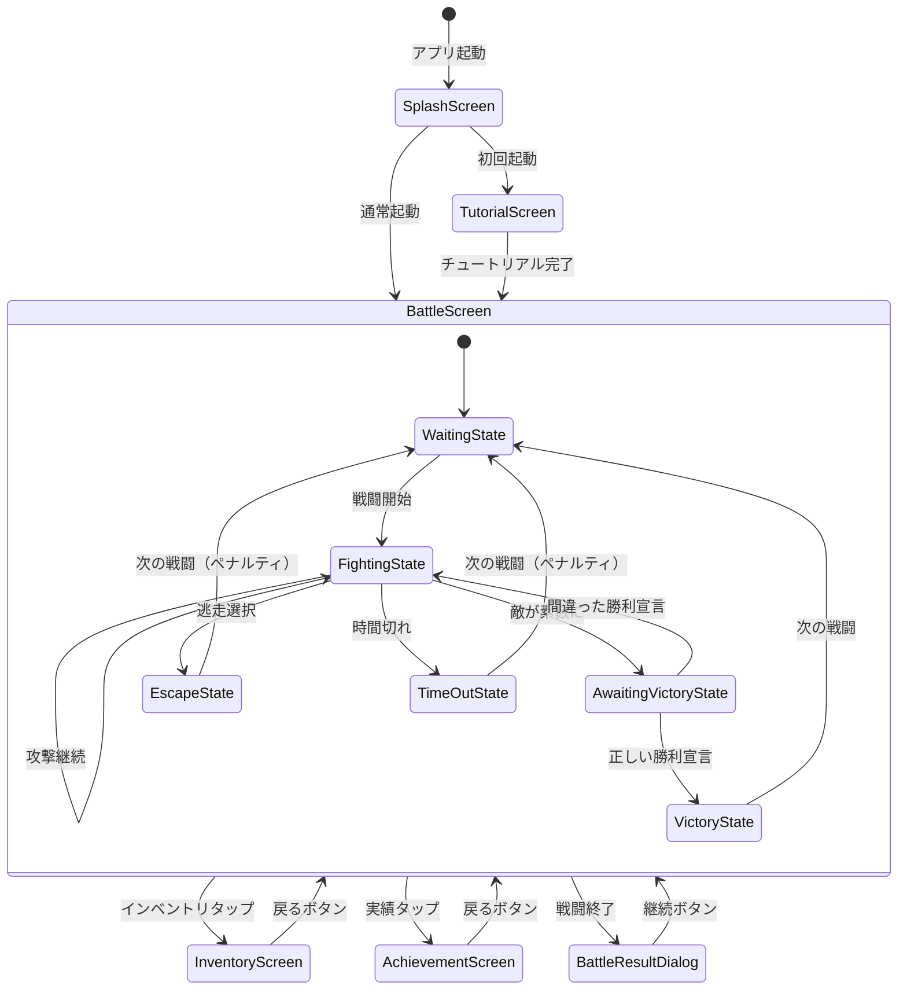
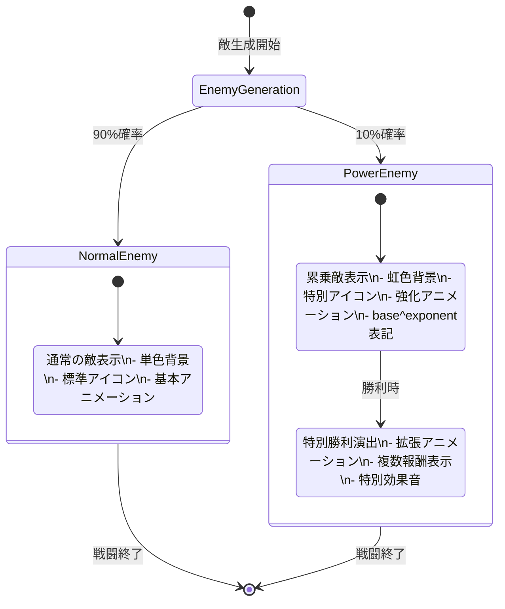
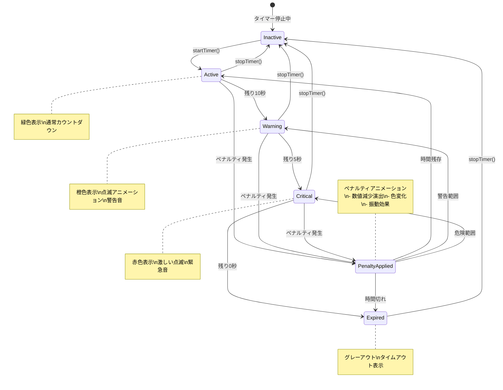
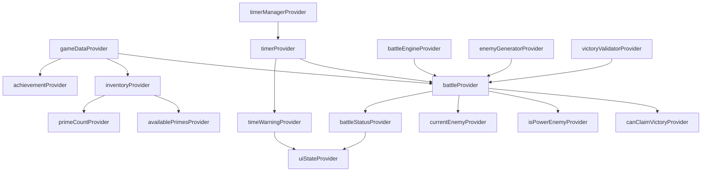
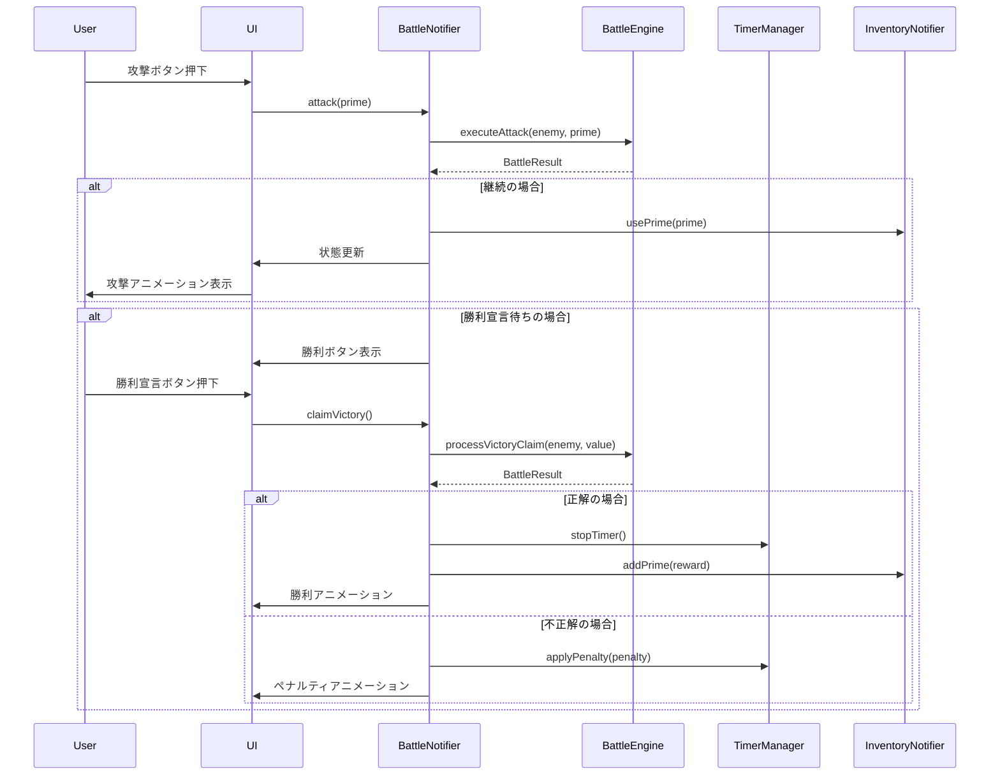

# 合成数ハンター 詳細クラス設計書

## 1. クラス図

### 1.1 ドメイン層クラス図

```mermaid
classDiagram
    class Prime {
        +int value
        +int count
        +DateTime firstObtained
        +int usageCount
        +bool isPrime
        +Prime copyWith()
        +bool operator==()
        +int hashCode
    }

    class Enemy {
        +int currentValue
        +int originalValue
        +EnemyType type
        +List~int~ primeFactors
        +bool isPowerEnemy
        +int? powerBase
        +int? powerExponent
        +int powerRewardCount
        +int powerRewardPrime
        +bool isDefeated
        +bool canBeAttackedBy(int prime)
        +Enemy attack(int prime)
        +Enemy copyWith()
    }

    class TimerState {
        +int remainingSeconds
        +int originalSeconds
        +bool isActive
        +bool isWarning
        +List~TimePenalty~ penalties
        +bool isExpired
        +bool shouldShowWarning
        +int totalPenaltySeconds
        +TimerState applyPenalty(TimePenalty penalty)
        +TimerState tick()
        +TimerState copyWith()
    }

    class TimePenalty {
        +int seconds
        +PenaltyType type
        +DateTime appliedAt
    }

    class VictoryClaim {
        +int claimedValue
        +DateTime claimedAt
        +bool isCorrect
        +int? rewardPrime
        +VictoryClaim copyWith()
    }

    class BattleState {
        +Enemy? currentEnemy
        +List~Prime~ usedPrimes
        +BattleStatus status
        +int turnCount
        +DateTime? battleStartTime
        +TimerState? timerState
        +VictoryClaim? victoryClaim
        +List~TimePenalty~ battlePenalties
        +bool canFight(List~Prime~ inventory)
        +bool canClaimVictory
        +BattleState nextTurn(Prime usedPrime)
        +BattleState applyTimePenalty(TimePenalty penalty)
        +BattleState copyWith()
    }

    class Inventory {
        +List~Prime~ primes
        +int totalCount
        +int uniqueCount
        +List~Prime~ availablePrimes
        +Prime? getPrime(int value)
        +bool hasPrime(int value)
        +Inventory addPrime(Prime prime)
        +Inventory usePrime(Prime prime)
        +Inventory copyWith()
    }

    BattleState --> Enemy : contains
    BattleState --> Prime : uses
    BattleState --> TimerState : has
    BattleState --> VictoryClaim : has
    BattleState --> TimePenalty : tracks
    TimerState --> TimePenalty : applies
    Inventory --> Prime : manages

    <<enumeration>> EnemyType
    EnemyType : SMALL
    EnemyType : MEDIUM
    EnemyType : LARGE
    EnemyType : POWER
    EnemyType : SPECIAL

    <<enumeration>> BattleStatus
    BattleStatus : WAITING
    BattleStatus : FIGHTING
    BattleStatus : VICTORY
    BattleStatus : ESCAPE
    BattleStatus : DEFEAT
    BattleStatus : TIMEOUT

    <<enumeration>> PenaltyType
    PenaltyType : ESCAPE
    PenaltyType : WRONG_VICTORY_CLAIM
    PenaltyType : TIME_OUT
```

### 1.2 ビジネスロジック層クラス図


### 1.3 プレゼンテーション層クラス図



## 2. メソッド仕様

### 2.1 Enemy クラス

#### attack(int prime) → Enemy
```dart
/// 敵に素数で攻撃を行う
/// 
/// Parameters:
///   - prime: 攻撃に使用する素数
/// 
/// Returns:
///   - 攻撃後の敵の状態
/// 
/// Throws:
///   - InvalidAttackException: 攻撃できない素数の場合
/// 
/// Preconditions:
///   - prime > 0
///   - currentValue % prime == 0
/// 
/// Postconditions:
///   - 戻り値のcurrentValue == 元のcurrentValue / prime
///   - originalValueは変更されない
```

#### canBeAttackedBy(int prime) → bool
```dart
/// 指定された素数で攻撃可能かを判定
/// 
/// Parameters:
///   - prime: 判定対象の素数
/// 
/// Returns:
///   - true: 攻撃可能, false: 攻撃不可能
/// 
/// Complexity: O(1)
```

### 2.2 TimerManager クラス

#### startTimer(int seconds) → void
```dart
/// タイマーを開始する
/// 
/// Parameters:
///   - seconds: タイマーの初期秒数
/// 
/// Side Effects:
///   - 既存のタイマーが停止される
///   - 新しいタイマーストリームが開始される
///   - 毎秒timerStreamに更新が送信される
/// 
/// Preconditions:
///   - seconds > 0
```

#### applyPenalty(TimePenalty penalty) → void
```dart
/// ペナルティを適用してタイマーを減少させる
/// 
/// Parameters:
///   - penalty: 適用するペナルティ情報
/// 
/// Side Effects:
///   - remainingSecondsが減少される
///   - penaltiesリストに追加される
///   - timerStreamに更新が送信される
/// 
/// Postconditions:
///   - remainingSeconds >= 0 (負数にはならない)
```

### 2.3 BattleEngine クラス

#### executeAttack(Enemy enemy, Prime prime) → BattleResult
```dart
/// 戦闘での攻撃を実行する
/// 
/// Parameters:
///   - enemy: 攻撃対象の敵
///   - prime: 使用する素数
/// 
/// Returns:
///   - BattleResult: 攻撃結果のUnion Type
/// 
/// Business Rules:
///   - 攻撃後に敵が素数になった場合は勝利宣言待ち状態
///   - 攻撃後も合成数の場合は戦闘継続
///   - 攻撃不可能な素数の場合はエラー
```

#### processVictoryClaim(Enemy enemy, int claimedValue) → BattleResult
```dart
/// 勝利宣言を処理する
/// 
/// Parameters:
///   - enemy: 現在の敵
///   - claimedValue: プレイヤーが宣言した値
/// 
/// Returns:
///   - BattleResult: 勝利判定結果
/// 
/// Business Rules:
///   - claimedValueが素数の場合: 勝利
///   - 累乗敵の場合: 特別報酬付き勝利
///   - claimedValueが合成数の場合: ペナルティ
```

### 2.4 BattleNotifier クラス

#### attack(Prime prime) → Future<void>
```dart
/// 戦闘画面での攻撃アクションを処理
/// 
/// Parameters:
///   - prime: 使用する素数
/// 
/// Side Effects:
///   - 攻撃アニメーションを再生
///   - インベントリから素数を消費
///   - 戦闘状態を更新
///   - UI状態を更新
/// 
/// Async Operations:
///   - アニメーション再生 (500ms)
///   - 状態の永続化
```

#### claimVictory() → Future<void>
```dart
/// 勝利宣言を処理
/// 
/// Side Effects:
///   - 勝利判定を実行
///   - 正解の場合: 勝利アニメーション + 報酬付与
///   - 不正解の場合: ペナルティアニメーション + タイム減少
///   - タイマー停止
///   - 実績チェック
/// 
/// Preconditions:
///   - canClaimVictory == true
```

## 3. データフロー図

### 3.1 戦闘フロー



### 3.2 タイマーフロー

```mermaid
flowchart TD
    A[戦闘開始] --> B[TimerManager.startTimer]
    B --> C[Stream<TimerState>開始]
    C --> D[毎秒tick()]
    
    D --> E{残り時間チェック}
    E -->|時間あり| F[UI更新]
    E -->|10秒以下| G[警告表示]
    E -->|0秒| H[タイムアウト処理]
    
    F --> I[BattleNotifier状態更新]
    G --> I
    H --> J[BattleEngine.processTimeOut]
    
    J --> K[ペナルティ記録]
    K --> L[新戦闘開始]
    
    M[ペナルティ発生] --> N[TimerManager.applyPenalty]
    N --> O[remainingSeconds減少]
    O --> P[Stream更新]
    P --> I
```

### 3.3 累乗敵検出フロー



## 4. UI画面遷移図

### 4.1 全体画面遷移



### 4.2 戦闘画面状態遷移詳細


### 4.3 累乗敵UI状態



### 4.4 タイマーUI状態



## 5. 状態管理フロー

### 5.1 Riverpod プロバイダー依存関係



### 5.2 状態更新シーケンス



この詳細設計書により、各クラスの実装指針と相互作用が明確になり、開発時の指針として活用できます。