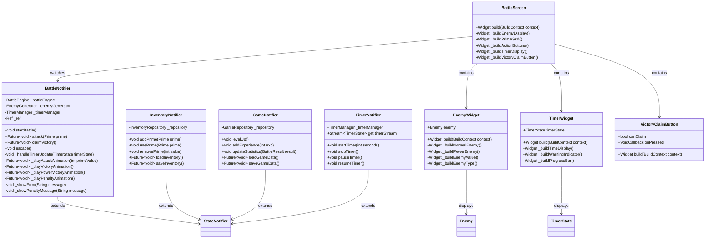

# 合成数ハンター 詳細クラス設計書

## 1. クラス図

### 1.1 ドメイン層クラス図

```mermaid
classDiagram
    class Prime {
        +int value
        +int count
        +DateTime firstObtained
        +int usageCount
        +bool isPrime
        +Prime copyWith()
        +bool operator==()
        +int hashCode
    }

    class Enemy {
        +int currentValue
        +int originalValue
        +EnemyType type
        +List~int~ primeFactors
        +bool isPowerEnemy
        +int? powerBase
        +int? powerExponent
        +int powerRewardCount
        +int powerRewardPrime
        +bool isDefeated
        +bool canBeAttackedBy(int prime)
        +Enemy attack(int prime)
        +Enemy copyWith()
    }

    class TimerState {
        +int remainingSeconds
        +int originalSeconds
        +bool isActive
        +bool isWarning
        +List~TimePenalty~ penalties
        +bool isExpired
        +bool shouldShowWarning
        +int totalPenaltySeconds
        +TimerState applyPenalty(TimePenalty penalty)
        +TimerState tick()
        +TimerState copyWith()
    }

    class TimePenalty {
        +int seconds
        +PenaltyType type
        +DateTime appliedAt
    }

    class VictoryClaim {
        +int claimedValue
        +DateTime claimedAt
        +bool isCorrect
        +int? rewardPrime
        +VictoryClaim copyWith()
    }

    class BattleState {
        +Enemy? currentEnemy
        +List~Prime~ usedPrimes
        +BattleStatus status
        +int turnCount
        +DateTime? battleStartTime
        +TimerState? timerState
        +VictoryClaim? victoryClaim
        +List~TimePenalty~ battlePenalties
        +bool canFight(List~Prime~ inventory)
        +bool canClaimVictory
        +BattleState nextTurn(Prime usedPrime)
        +BattleState applyTimePenalty(TimePenalty penalty)
        +BattleState copyWith()
    }

    class Inventory {
        +List~Prime~ primes
        +int totalCount
        +int uniqueCount
        +List~Prime~ availablePrimes
        +Prime? getPrime(int value)
        +bool hasPrime(int value)
        +Inventory addPrime(Prime prime)
        +Inventory usePrime(Prime prime)
        +Inventory copyWith()
    }

    BattleState --> Enemy : contains
    BattleState --> Prime : uses
    BattleState --> TimerState : has
    BattleState --> VictoryClaim : has
    BattleState --> TimePenalty : tracks
    TimerState --> TimePenalty : applies
    Inventory --> Prime : manages

    <<enumeration>> EnemyType
    EnemyType : SMALL
    EnemyType : MEDIUM
    EnemyType : LARGE
    EnemyType : POWER
    EnemyType : SPECIAL

    <<enumeration>> BattleStatus
    BattleStatus : WAITING
    BattleStatus : FIGHTING
    BattleStatus : VICTORY
    BattleStatus : ESCAPE
    BattleStatus : DEFEAT
    BattleStatus : TIMEOUT

    <<enumeration>> PenaltyType
    PenaltyType : ESCAPE
    PenaltyType : WRONG_VICTORY_CLAIM
    PenaltyType : TIME_OUT
```

### 1.2 ビジネスロジック層クラス図


### 1.3 プレゼンテーション層クラス図



## 2. メソッド仕様

### 2.1 Enemy クラス

#### attack(int prime) → Enemy
```dart
/// 敵に素数で攻撃を行う
/// 
/// Parameters:
///   - prime: 攻撃に使用する素数
/// 
/// Returns:
///   - 攻撃後の敵の状態
/// 
/// Throws:
///   - InvalidAttackException: 攻撃できない素数の場合
/// 
/// Preconditions:
///   - prime > 0
///   - currentValue % prime == 0
/// 
/// Postconditions:
///   - 戻り値のcurrentValue == 元のcurrentValue / prime
///   - originalValueは変更されない
```

#### canBeAttackedBy(int prime) → bool
```dart
/// 指定された素数で攻撃可能かを判定
/// 
/// Parameters:
///   - prime: 判定対象の素数
/// 
/// Returns:
///   - true: 攻撃可能, false: 攻撃不可能
/// 
/// Complexity: O(1)
```

### 2.2 TimerManager クラス

#### startTimer(int seconds) → void
```dart
/// タイマーを開始する
/// 
/// Parameters:
///   - seconds: タイマーの初期秒数
/// 
/// Side Effects:
///   - 既存のタイマーが停止される
///   - 新しいタイマーストリームが開始される
///   - 毎秒timerStreamに更新が送信される
/// 
/// Preconditions:
///   - seconds > 0
```

#### applyPenalty(TimePenalty penalty) → void
```dart
/// ペナルティを適用してタイマーを減少させる
/// 
/// Parameters:
///   - penalty: 適用するペナルティ情報
/// 
/// Side Effects:
///   - remainingSecondsが減少される
///   - penaltiesリストに追加される
///   - timerStreamに更新が送信される
/// 
/// Postconditions:
///   - remainingSeconds >= 0 (負数にはならない)
```

### 2.3 BattleEngine クラス

#### executeAttack(Enemy enemy, Prime prime) → BattleResult
```dart
/// 戦闘での攻撃を実行する
/// 
/// Parameters:
///   - enemy: 攻撃対象の敵
///   - prime: 使用する素数
/// 
/// Returns:
///   - BattleResult: 攻撃結果のUnion Type
/// 
/// Business Rules:
///   - 攻撃後に敵が素数になった場合は勝利宣言待ち状態
///   - 攻撃後も合成数の場合は戦闘継続
///   - 攻撃不可能な素数の場合はエラー
```

#### processVictoryClaim(Enemy enemy, int claimedValue) → BattleResult
```dart
/// 勝利宣言を処理する
/// 
/// Parameters:
///   - enemy: 現在の敵
///   - claimedValue: プレイヤーが宣言した値
/// 
/// Returns:
///   - BattleResult: 勝利判定結果
/// 
/// Business Rules:
///   - claimedValueが素数の場合: 勝利
///   - 累乗敵の場合: 特別報酬付き勝利
///   - claimedValueが合成数の場合: ペナルティ
```

### 2.4 BattleNotifier クラス

#### attack(Prime prime) → Future<void>
```dart
/// 戦闘画面での攻撃アクションを処理
/// 
/// Parameters:
///   - prime: 使用する素数
/// 
/// Side Effects:
///   - 攻撃アニメーションを再生
///   - インベントリから素数を消費
///   - 戦闘状態を更新
///   - UI状態を更新
/// 
/// Async Operations:
///   - アニメーション再生 (500ms)
///   - 状態の永続化
```

#### claimVictory() → Future<void>
```dart
/// 勝利宣言を処理
/// 
/// Side Effects:
///   - 勝利判定を実行
///   - 正解の場合: 勝利アニメーション + 報酬付与
///   - 不正解の場合: ペナルティアニメーション + タイム減少
///   - タイマー停止
///   - 実績チェック
/// 
/// Preconditions:
///   - canClaimVictory == true
```

## 3. データフロー図

### 3.1 戦闘フロー


### 3.2 タイマーフロー

```mermaid
flowchart TD
    A[戦闘開始] --> B[TimerManager.startTimer]
    B --> C[Stream<TimerState>開始]
    C --> D[毎秒tick()]
    
    D --> E{残り時間チェック}
    E -->|時間あり| F[UI更新]
    E -->|10秒以下| G[警告表示]
    E -->|0秒| H[タイムアウト処理]
    
    F --> I[BattleNotifier状態更新]
    G --> I
    H --> J[BattleEngine.processTimeOut]
    
    J --> K[ペナルティ記録]
    K --> L[新戦闘開始]
    
    M[ペナルティ発生] --> N[TimerManager.applyPenalty]
    N --> O[remainingSeconds減少]
    O --> P[Stream更新]
    P --> I
```

### 3.3 累乗敵検出フロー


## 4. UI画面遷移図（現在の実装ベース）

### 4.1 全体画面遷移


### 4.2 戦闘画面状態遷移詳細


### 4.3 累乗敵UI状態


### 4.4 タイマーUI状態


## 5. 状態管理フロー

### 5.1 Riverpod プロバイダー依存関係


### 5.2 状態更新シーケンス


## 6. ステージ挑戦前画面の設計（現在の実装ベース）

### 6.1 StageSelectScreen クラス

```dart
class StageSelectScreen extends ConsumerStatefulWidget {
  // ステージ選択画面の実装
  
  /// ステージ情報の表示
  Widget _buildStageCard(StageInfo stage) {
    return Card(
      child: InkWell(
        onTap: stage.isUnlocked ? () => _goToItemSelection(stage) : null,
        child: StageCardContent(stage: stage),
      ),
    );
  }
  
  /// アイテム選択画面へ遷移
  void _goToItemSelection(StageInfo stage) {
    AppRouter.goToStageItemSelection(context, stage);
  }
  
  /// 練習モード開始（アイテム選択なし）
  void _startPracticeMode() {
    final currentInventory = ref.read(inventoryProvider);
    ref.read(battleSessionProvider.notifier).startPractice(currentInventory);
    AppRouter.goToBattle(context);
  }
}
```

### 6.2 StageItemSelectionScreen クラス（新規実装）

```dart
class StageItemSelectionScreen extends ConsumerStatefulWidget {
  final StageInfo stage;
  
  const StageItemSelectionScreen({
    super.key,
    required this.stage,
  });
  
  @override
  ConsumerState<StageItemSelectionScreen> createState() => _StageItemSelectionScreenState();
}

class _StageItemSelectionScreenState extends ConsumerState<StageItemSelectionScreen> {
  Set<int> selectedPrimeValues = {};
  
  /// ステージ別アイテム制限数を取得
  int get maxSelectableItems {
    switch (widget.stage.stageNumber) {
      case 1: return 3;  // 初心者向け：3個まで
      case 2: return 5;  // 中級者向け：5個まで
      case 3: return 7;  // 上級者向け：7個まで  
      case 4: return 10; // 最上級者向け：10個まで
      default: return 5;
    }
  }
  
  /// アイテム選択/選択解除の処理
  void _toggleItemSelection(int primeValue) {
    setState(() {
      if (selectedPrimeValues.contains(primeValue)) {
        selectedPrimeValues.remove(primeValue);
      } else if (selectedPrimeValues.length < maxSelectableItems) {
        selectedPrimeValues.add(primeValue);
      }
    });
  }
  
  /// 選択されたアイテムでバトル開始
  void _startBattleWithSelectedItems() {
    // 選択されたアイテムで一時的なインベントリを作成
    final selectedInventory = _createSelectedInventory();
    
    // バトルセッションを開始（選択されたアイテムのみ）
    ref.read(battleSessionProvider.notifier).startStageWithSelectedItems(
      widget.stage.stageNumber,
      selectedInventory,
    );
    
    // バトル画面に遷移
    AppRouter.goToBattle(context);
  }
  
  /// 選択されたアイテムからインベントリを作成
  List<Prime> _createSelectedInventory() {
    final allPrimes = ref.read(inventoryProvider);
    return allPrimes.where((prime) => 
      selectedPrimeValues.contains(prime.value) && prime.count > 0
    ).toList();
  }
}
```

### 6.2 StageInfo エンティティ（現在の実装）

```dart
class StageInfo {
  final int stageNumber;
  final String title;
  final String description;
  final int enemyRangeMin;        // 敵数値の最小値
  final int enemyRangeMax;        // 敵数値の最大値
  final int timeLimit;            // 制限時間
  final bool isUnlocked;          // アンロック状態
  final bool isCompleted;         // クリア状態
  final int stars;                // 獲得星数
  
  /// ステージ挑戦可能性の判定
  bool canChallenge(List<Prime> inventory) {
    return isUnlocked && inventory.isNotEmpty;
  }
  
  /// ローカライズされたタイトル取得
  String getLocalizedTitle(AppLocalizations l10n) {
    switch (stageNumber) {
      case 1: return l10n.stage1Title;
      case 2: return l10n.stage2Title;
      case 3: return l10n.stage3Title;
      case 4: return l10n.stage4Title;
      default: return title;
    }
  }
}
```

### 6.3 ステージ挑戦前の状態管理フロー（アイテム選択画面追加）


### 6.4 アイテム選択画面の詳細仕様

#### 6.4.1 ステージ別制限数（素数の総個数）
```dart
Map<int, int> stageItemLimits = {
  1: 8,  // ステージ1：初心者向け、8個までの素数を選択
  2: 15, // ステージ2：中級者向け、15個までの素数を選択
  3: 25, // ステージ3：上級者向け、25個までの素数を選択
  4: 40, // ステージ4：最上級者向け、40個までの素数を選択
};
```

**重要な変更点：**
- 制限対象：素数の種類数 → 素数の総個数
- 例：Prime(value: 2, count: 5)の場合、5個分としてカウント
- プレイヤーは各素数から何個取るかを選択可能

#### 6.4.2 UI状態管理（個数ベース選択）
```dart
class ItemSelectionState {
  final Map<int, int> selectedCounts; // prime value -> selected count
  final int maxSelectableCount;       // 最大選択可能な総個数
  final List<Prime> availableItems;
  
  int get totalSelectedCount => selectedCounts.values.fold(0, (sum, count) => sum + count);
  bool get hasReachedLimit => totalSelectedCount >= maxSelectableCount;
  bool get hasMinimumSelection => totalSelectedCount >= 1;
  int get remainingCount => maxSelectableCount - totalSelectedCount;
  
  ItemSelectionState copyWith({
    Map<int, int>? selectedCounts,
    int? maxSelectableCount,
    List<Prime>? availableItems,
  }) {
    return ItemSelectionState(
      selectedCounts: selectedCounts ?? this.selectedCounts,
      maxSelectableCount: maxSelectableCount ?? this.maxSelectableCount,
      availableItems: availableItems ?? this.availableItems,
    );
  }
}
```

#### 6.4.3 教育的配慮
- **選択制限の可視化**: 現在選択数/最大選択数を常に表示
- **戦略的思考の促進**: 制限された選択肢での最適解を考えさせる
- **段階的難易度**: ステージが進むにつれて選択肢が増加
- **失敗からの学習**: 選択ミスによる失敗も学習機会として提供

## 7. 無効攻撃システムの設計（教育強化機能）

### 7.1 基本方針
従来は「正しくない素数では攻撃できない」仕様でしたが、教育効果を高めるため「正しくない素数でも攻撃可能だが効果なし」に変更。

### 7.2 無効攻撃の動作

#### 7.2.1 攻撃可能条件
```dart
// 従来の条件
bool canAttack = (enemy % prime == 0) && (prime.count > 0);

// 新しい条件
bool canAttack = prime.count > 0; // 所持数があれば常に攻撃可能
bool isEffective = (enemy % prime == 0) && (prime.count > 0); // 効果的かどうかは別判定
```

#### 7.2.2 攻撃処理フロー


### 7.3 教育的フィードバック機能

#### 7.3.1 フィードバック内容
1. **即座の視覚的フィードバック**
   - SnackBar: "Prime X wasted! Enemy ÷ X is not a whole number."
   - 色: エラー色（赤）

2. **詳細な教育ダイアログ**
   - タイトル: "Attack Failed!"
   - 説明: なぜ攻撃が失敗したか
   - 数学的解説: 「X ÷ Y = Z.abc (not a whole number)」
   - 敵の素因数分解表示: 「Enemy = 2 × 3 × 5」
   - 推奨行動: "Try using one of these factors instead!"

#### 7.3.2 UI視覚的区別
```dart
// 素数ボタンの状態表示
enum PrimeButtonState {
  unavailable,  // 所持数0：グレーアウト
  ineffective,  // 所持数あり・無効：警告色（オレンジ）+ ？アイコン
  effective,    // 所持数あり・有効：通常色（青/緑）+ ✓アイコン
}
```

#### 7.3.3 学習効果測定
```dart
class BattleAnalytics {
  int validAttacks = 0;
  int invalidAttacks = 0;
  Map<int, int> invalidAttacksByPrime = {}; // どの素数で間違いやすいか
  
  double get attackAccuracy => validAttacks / (validAttacks + invalidAttacks);
  List<int> get problematicPrimes => invalidAttacksByPrime.entries
      .where((e) => e.value > 2)
      .map((e) => e.key)
      .toList();
}
```

## 7. アイテム消費ロジックの詳細設計（現在の実装ベース）

### 7.1 BattleSessionProvider クラス

```dart
class BattleSessionProvider extends StateNotifier<BattleSession> {
  /// ステージ戦闘開始
  void startStage(int stageNumber, Inventory currentInventory) {
    state = state.copyWith(
      stageNumber: stageNumber,
      isPracticeMode: false,
      stageStartInventory: currentInventory.primes, // スナップショット保存
      victories: 0,
      escapes: 0,
      wrongClaims: 0,
      usedPrimesInCurrentBattle: [],
    );
  }
  
  /// 練習モード開始
  void startPractice(Inventory currentInventory) {
    state = state.copyWith(
      stageNumber: null,
      isPracticeMode: true,
      stageStartInventory: currentInventory.primes,
      victories: 0,
      escapes: 0,
      wrongClaims: 0,
      usedPrimesInCurrentBattle: [],
    );
  }
  
  /// アイテム状態復元
  void restoreInventory() {
    if (state.stageStartInventory != null) {
      // インベントリプロバイダーに復元指示
    }
  }
}
```

### 7.2 アイテム消費・復元フロー


### 7.3 実装における教育的配慮

#### 練習モードの非消費設計
```dart
// 戦闘中のアイテム使用処理
if (canAttack && prime.count > 0) {
  final session = ref.read(battleSessionProvider);
  
  // 敵の数値を更新
  ref.read(battleEnemyProvider.notifier).state = enemy ~/ prime.value;
  
  // 練習モードでない場合のみアイテムを消費
  if (!session.isPracticeMode) {
    ref.read(inventoryProvider.notifier).usePrime(prime.value);
  }
  
  // 使用した素数を記録（復元用）
  ref.read(battleSessionProvider.notifier).recordUsedPrime(prime.value);
}
```

#### 復元システムの実装
```dart
// エスケープ時の復元処理
void _escapeButton() {
  // アイテム状態をステージ開始時に復元
  final session = ref.read(battleSessionProvider);
  if (session.stageStartInventory != null) {
    ref.read(inventoryProvider.notifier).restoreInventory(session.stageStartInventory!);
  }
  
  // 使用素数記録をリセット
  ref.read(battleSessionProvider.notifier).resetUsedPrimes();
  
  // 新しい敵を生成して戦闘継続
  _generateNewEnemy();
  _restartTimer();
}
```

この詳細設計書により、現在の実装における各クラスの実装指針と相互作用が明確になり、開発時の指針として活用できます。簡素化されたアーキテクチャにより、教育的価値を保ちながら開発・保守コストを最小限に抑えることができます。